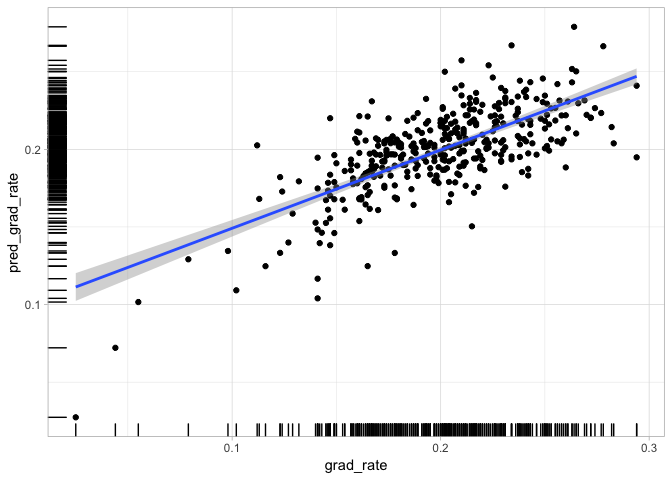
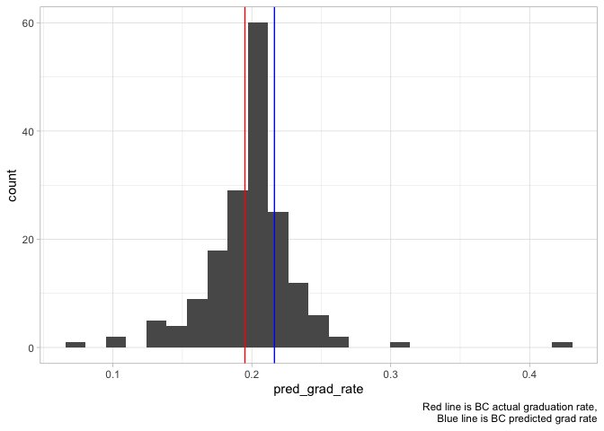

classifier
================
jason grahn
5/25/2019

``` r
#load training
training <- read_csv(here::here("data/train_data.csv")) %>% 
  dplyr::select(-contains("X"), -id)
```

    ## Parsed with column specification:
    ## cols(
    ##   .default = col_double(),
    ##   institution_name = col_character(),
    ##   basic = col_character()
    ## )

    ## See spec(...) for full column specifications.

``` r
#load testing
testing <- read_csv(here::here("data/test_data.csv")) %>% 
  dplyr::select(-contains("X"), -id) 
```

    ## Parsed with column specification:
    ## cols(
    ##   .default = col_double(),
    ##   institution_name = col_character(),
    ##   basic = col_character()
    ## )
    ## See spec(...) for full column specifications.

``` r
model.1 <- lm(grad_rate ~ student_count +spending_per_award +full_time_pct
             +full_time_count +med_sat_value +aid_value
             +endow_value +grad_on_time_pct +pell_value +fresh_retain_value
             + full_time_fac_pct,
             data = training)

#remove outliers using model 1
training_without_outliers <- add_residuals(data = training,
                                           model = model.1,
                                           var = "resid") %>% 
  mutate(sdev = sd(resid),
                std.norm = resid / sdev,
                abs.std = abs(std.norm)) %>% #note: 407 rows at this point
   #dplyr::arrange(desc(abs.std)) %>% 
  filter(abs.std < 2)
```

``` r
model.10 <- lm(grad_rate ~ spending_per_award 
               + full_time_count
               + med_sat_value
               + endow_value
               + grad_on_time_pct
               + pell_value
               + fresh_retain_value
             + endow_value*spending_per_award     #EndowXSpend
             + pell_value*med_sat_value           #PellXSat
             + fresh_retain_value*med_sat_value   #RetainXSat
             ,data = training_without_outliers)
```

``` r
training_with_predictions <- add_predictions(training_without_outliers, model.10, var = "pred_grad_rate") %>% 
  #and we dont need these other variables either
  dplyr::select(-resid, -sdev, -std.norm, -abs.std) %>% 
  mutate(scaled = scale(pred_grad_rate))

#and a quick visual of known graduation to predicuted graduation
training_with_predictions %>% 
  ggplot(aes(x = grad_rate, y = pred_grad_rate)) +
  geom_point() + 
  geom_smooth(method = "lm") + 
  geom_rug() +
  theme_light()
```

<!-- -->

``` r
#histogram of scaled predictions
training_with_predictions %>% 
  ggplot() +
  geom_histogram(aes(x = pred_grad_rate), bins = 25) +
  theme_light() 
```

<!-- -->

``` r
testing_with_predictions <- add_predictions(testing, model.10, var = "pred_grad_rate") %>% 
  #and we dont need these other variables either
  #dplyr::select(-resid, -sdev, -std.norm, -abs.std) %>% 
  mutate(scaled = scale(pred_grad_rate))

#and a quick visual of known graduation to predicuted graduation
testing_with_predictions %>% 
  ggplot(aes(x = grad_rate, y = pred_grad_rate)) +
  geom_point() + 
  geom_smooth(method = "lm") + 
  geom_rug() +
  theme_light()
```

<!-- -->

``` r
#histogram of scaled predictions
testing_with_predictions %>% 
  ggplot() +
  geom_histogram(aes(x = pred_grad_rate), bins = 25) +
  geom_vline(aes(xintercept = 0.2162771), color = "blue") +
  geom_vline(aes(xintercept = 0.195), color = "red") +
  theme_light() +
  labs(caption = "Red line is BC actual graduation rate,
  Blue line is BC predicted grad rate")
```

<!-- -->

``` r
#testing_with_predictions %>% filter(institution_name == "Bellevue College")
```

``` r
testing_with_predictions %>% filter(institution_name == "Bellevue College")
```

    ## # A tibble: 1 x 16
    ##   institution_name basic grad_rate student_count spending_per_aw…
    ##   <chr>            <chr>     <dbl>         <dbl>            <dbl>
    ## 1 Bellevue College Asso…     0.195         13820            26904
    ## # … with 11 more variables: full_time_pct <dbl>, full_time_count <dbl>,
    ## #   med_sat_value <dbl>, aid_value <dbl>, endow_value <dbl>,
    ## #   grad_on_time_pct <dbl>, pell_value <dbl>, fresh_retain_value <dbl>,
    ## #   full_time_fac_pct <dbl>, pred_grad_rate <dbl>, scaled[,1] <dbl>
