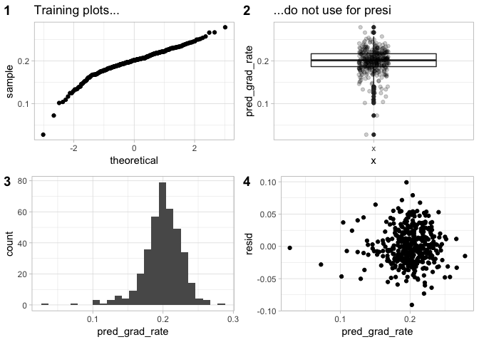
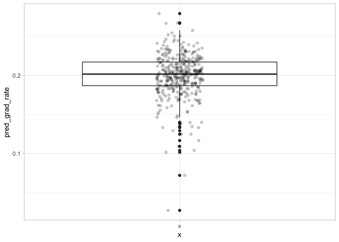
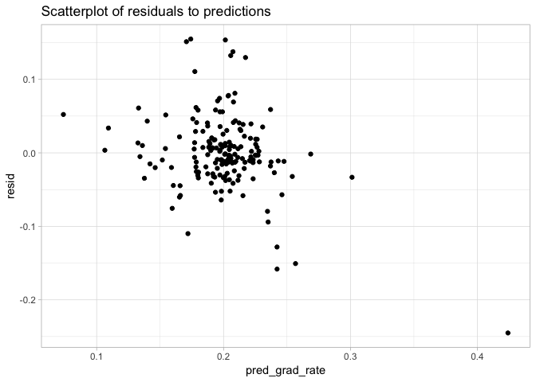

classifier
================
jason grahn
5/25/2019

``` r
#load training
training <- read_csv(here::here("data/train_data.csv")) %>% 
  dplyr::select(-contains("X"), -id)
```

    ## Parsed with column specification:
    ## cols(
    ##   .default = col_double(),
    ##   institution_name = col_character(),
    ##   basic = col_character()
    ## )

    ## See spec(...) for full column specifications.

``` r
#load testing
testing <- read_csv(here::here("data/test_data.csv")) %>% 
  dplyr::select(-contains("X"), -id) 
```

    ## Parsed with column specification:
    ## cols(
    ##   .default = col_double(),
    ##   institution_name = col_character(),
    ##   basic = col_character()
    ## )
    ## See spec(...) for full column specifications.

``` r
model.1 <- lm(grad_rate ~ student_count +spending_per_award +full_time_pct
             +full_time_count +med_sat_value +aid_value
             +endow_value +grad_on_time_pct +pell_value +fresh_retain_value
             + full_time_fac_pct,
             data = training)

#remove outliers using model 1
training_without_outliers <- add_residuals(data = training,
                                           model = model.1,
                                           var = "resid") %>% 
  mutate(sdev = sd(resid),
                std.norm = resid / sdev,
                abs.std = abs(std.norm)) %>% #note: 407 rows at this point
   #dplyr::arrange(desc(abs.std)) %>% 
  filter(abs.std < 2)
```

``` r
model.10 <- lm(grad_rate ~ spending_per_award 
               + full_time_count
               + med_sat_value
               + endow_value
               + grad_on_time_pct
               + pell_value
               + fresh_retain_value
             + endow_value*spending_per_award     #EndowXSpend
             + pell_value*med_sat_value           #PellXSat
             + fresh_retain_value*med_sat_value   #RetainXSat
             ,data = training_without_outliers)
```

``` r
training_with_predictions <- add_predictions(training_without_outliers, model.10, var = "pred_grad_rate") %>% 
  add_residuals(model = model.10, var = "resid") %>% 
  #and we dont need these other variables either
  dplyr::select(-sdev, -std.norm, -abs.std) %>% 
  mutate(scaled = scale(pred_grad_rate))
```

``` r
#and a quick visual of known graduation to predicuted graduation
training_predictions_scatter <- training_with_predictions %>% 
  ggplot(aes(x = grad_rate, y = pred_grad_rate)) +
  geom_point() + 
  geom_smooth(method = "lm") + 
  geom_rug() +
  theme_light()

training_predictions_boxplot <- training_with_predictions %>% 
  arrange(basic) %>% 
  #mutate(TRUE == TRUE) %>% 
         #instituion_type = str_sub(basic, start = 1L, end = 5L),
         #instituion_type = case_when(instituion_type == "Assoc" ~ "Associates",
          #                           instituion_type == "Bacca" ~ "Baccalaureate",
          #                           instituion_type == "Docto" ~ "Doctoral",
          #                           instituion_type == "Maste" ~ "Masters",
          #                           instituion_type == "Resea" ~ "Research",
          #                           instituion_type == "Schoo" ~ "Specialty",
          #                           instituion_type == "Triba" ~ "Tribal")) %>% 
  ggplot(aes(y = pred_grad_rate, x = "x")) +
  geom_boxplot() + 
  geom_jitter(alpha = 0.2, width = .09) +
  theme_light()

#histogram of scaled predictions
training_predictions_histogram <- training_with_predictions %>% 
  ggplot() +
  geom_histogram(aes(x = pred_grad_rate), bins = 25) +
  theme_light() 

training_pred_vs_resids <- training_with_predictions %>% 
  ggplot() +
  geom_point(aes(x = pred_grad_rate, y = resid)) +
  theme_light() +
  labs(title = "",
       subtitle = "")

training_predictions_scatter
```

<!-- -->

``` r
training_predictions_boxplot
```

<!-- -->

``` r
training_predictions_histogram
```

<!-- -->

``` r
cowplot::plot_grid(training_predictions_scatter, 
                   training_predictions_boxplot, 
                   training_predictions_histogram,
                   training_pred_vs_resids,
                   labels = c("A", "B", "C", "D"))
```

<!-- -->

``` r
testing_with_predictions <- add_predictions(testing, model = model.10, var = "pred_grad_rate") %>% 
  add_residuals(model = model.10, var = "resid") %>% 
  #and we dont need these other variables either
  #dplyr::select(-resid, -sdev, -std.norm, -abs.std) %>% 
  mutate(scaled_act = scale(grad_rate), 
         scaled_pred = scale(pred_grad_rate),
         classification = factor(case_when(scaled_pred <= (-3) ~ "Poor",
                                           scaled_pred <= (-2) ~ "Below Average",
                                           scaled_pred <= (1) ~ "Average",
                                           scaled_pred <= (2) ~ "Above Average",
                                           scaled_pred > (2) ~ "Excellent"),
                                 levels = c("Excellent", "Above Average", "Average", "Below Average", "Poor"))
         ) %>% 
  arrange(pred_grad_rate)
```

``` r
#and a quick visual of known graduation to predicuted graduation
testing_predictions_scatter <- testing_with_predictions %>% 
  ggplot(aes(x = grad_rate, y = pred_grad_rate)) +
  geom_point() + 
  geom_smooth(method = "lm") + 
  geom_rug() +
  theme_light()

#histogram of scaled predictions
testing_predictions_histogram <- testing_with_predictions %>% 
  ggplot() +
  geom_histogram(aes(x = pred_grad_rate), bins = 25) +
  theme_light()

testing_predictions_boxplot <- testing_with_predictions %>% 
  arrange(basic) %>% 
  #mutate(TRUE == TRUE) %>% 
         #instituion_type = str_sub(basic, start = 1L, end = 5L),
         #instituion_type = case_when(instituion_type == "Assoc" ~ "Associates",
          #                           instituion_type == "Bacca" ~ "Baccalaureate",
          #                           instituion_type == "Docto" ~ "Doctoral",
          #                           instituion_type == "Maste" ~ "Masters",
          #                           instituion_type == "Resea" ~ "Research",
          #                           instituion_type == "Schoo" ~ "Specialty",
          #                           instituion_type == "Triba" ~ "Tribal")) %>% 
  ggplot(aes(y = pred_grad_rate, x = "x")) +
  geom_boxplot() + 
  geom_jitter(alpha = 0.2, width = .09) +
  theme_light()

testing_pred_vs_resids <- testing_with_predictions %>% 
  ggplot() +
  geom_point(aes(x = pred_grad_rate, y = resid)) +
  theme_light()

#testing_predictions_boxplot
#testing_predictions_scatter
#testing_predictions_histogram

cowplot::plot_grid(testing_predictions_scatter, 
                   testing_predictions_boxplot, 
                   testing_predictions_histogram, 
                   testing_pred_vs_resids,
                   labels = c("A", "B", "C", "D"))
```

<!-- -->

``` r
#testing_with_predictions %>% filter(institution_name == "Bellevue College")
```

``` r
vlines <- as.matrix(testing_with_predictions %>% 
                      filter(institution_name == "Bellevue College") %>% 
                      select(scaled_pred, scaled_act))

testing_with_predictions %>% 
  ggplot() +
  geom_histogram(aes(x = scaled_pred, fill = classification), binwidth = .15) +
 # scale_fill_gradient2(low = "red", mid = "grey", high = "green",midpoint = mpgr) +
  geom_vline(aes(xintercept = vlines[1]), color = "blue") +
  geom_vline(aes(xintercept = vlines[2]), color = "red") +
  theme_light() +
  theme(legend.position="none") +
  labs(title = "Histogram of Graduation Predictions",
       subtitle = "BC shows Average rates for both actual and prediction",
       x = "Predicted Graduation Rate",
       caption = "Red line is BC actual graduation rate,
  Blue line is BC predicted grad rate")
```

<!-- -->

``` r
testing_with_predictions %>% filter(institution_name == "Bellevue College")
```

    ## # A tibble: 1 x 19
    ##   institution_name basic grad_rate student_count spending_per_aw…
    ##   <chr>            <chr>     <dbl>         <dbl>            <dbl>
    ## 1 Bellevue College Asso…     0.195         13820            26904
    ## # … with 14 more variables: full_time_pct <dbl>, full_time_count <dbl>,
    ## #   med_sat_value <dbl>, aid_value <dbl>, endow_value <dbl>,
    ## #   grad_on_time_pct <dbl>, pell_value <dbl>, fresh_retain_value <dbl>,
    ## #   full_time_fac_pct <dbl>, pred_grad_rate <dbl>, resid <dbl>,
    ## #   scaled_act[,1] <dbl>, scaled_pred[,1] <dbl>, classification <fct>
