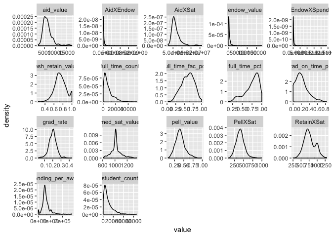

build interactions
================

``` r
knitr::opts_chunk$set(warning = FALSE, message = FALSE)
library(tidyverse)
```

    ## ── Attaching packages ───────────────────────────────────────────────────────────────────────────────────────────────── tidyverse 1.2.1 ──

    ## ✔ ggplot2 3.1.1       ✔ purrr   0.3.2  
    ## ✔ tibble  2.1.1       ✔ dplyr   0.8.0.1
    ## ✔ tidyr   0.8.3       ✔ stringr 1.4.0  
    ## ✔ readr   1.3.1       ✔ forcats 0.4.0

    ## Warning: package 'ggplot2' was built under R version 3.5.2

    ## Warning: package 'tibble' was built under R version 3.5.2

    ## Warning: package 'tidyr' was built under R version 3.5.2

    ## Warning: package 'purrr' was built under R version 3.5.2

    ## Warning: package 'dplyr' was built under R version 3.5.2

    ## Warning: package 'stringr' was built under R version 3.5.2

    ## Warning: package 'forcats' was built under R version 3.5.2

    ## ── Conflicts ──────────────────────────────────────────────────────────────────────────────────────────────────── tidyverse_conflicts() ──
    ## ✖ dplyr::filter() masks stats::filter()
    ## ✖ dplyr::lag()    masks stats::lag()

Our task today is to build interactions between each of the numeric variables.

CHECK - `renaming` - Marlie already renamed the variables, so we don't need to do that step.

CHECK - `filtering` - CHECK - We also learned that we only want the institutions that are similar to BC, so those need filtering too.

CHECK - `selecting` - There are a bunch of variables that we've kept for the sake of analysis (items like latitude and longitude). Those are not required for the sake of modeling. Before we build the interactions, we need to select only those variables we'll use.

CHECK - `interaction` - After we do that, THEN we can build the interactions. Build the interactions based on the correlations Marlie posted to the google drive. Build interactions of anything with correlations greater than (absolute value .5)

CHECK - `splitting` - Then we should build training and test datasets. Hmmm, one more thing; since **Bellevue College** is our customer, we should make sure this isn't part of the training data somehow.

Let's start by importing.

``` r
library(readr)
institution_data <- read_csv(here::here("data/institution_data_explore_mc - institution_data.csv"))
```

filtering
---------

Then filtering for just bc-like colleges

``` r
nrow(institution_data)
```

    ## [1] 3798

``` r
institution_data <- institution_data %>% 
  filter(level == "4-year",
         funding == "Public",
         flagship_binary == 0)

nrow(institution_data)
```

    ## [1] 582

we've dropped the number of rows from 3,798 to 582; which is what we wanted.

selecting
---------

Now we'll write some code to retain *only* the modeling variables.

``` r
bc_institution_data <- 
  institution_data %>% 
  select(institution_name,
         basic,
         grad_rate,
         student_count,
         spending_per_award,
         full_time_pct,
         full_time_count,
         med_sat_value,
         aid_value,
         endow_value,
         grad_on_time_pct, #ahh, i need to convert this to decimal as well.
         pell_value,
         fresh_retain_value,
         full_time_fac_pct) %>% 
  mutate(endow_value = as.integer(endow_value),
         med_sat_value = as.integer(med_sat_value),
         grad_on_time_pct = as.integer(grad_on_time_pct),
         grad_on_time_pct = grad_on_time_pct / 100)

head(bc_institution_data,5)
```

    ## # A tibble: 5 x 14
    ##   institution_name basic grad_rate student_count spending_per_aw…
    ##   <chr>            <chr>     <dbl>         <dbl>            <dbl>
    ## 1 Alabama A&M Uni… Mast…     0.142          4051           105331
    ## 2 University of A… Rese…     0.209         11502           136546
    ## 3 University of A… Rese…     0.209          5696            64418
    ## 4 Alabama State U… Mast…     0.116          5356           132407
    ## 5 Auburn Universi… Mast…     0.154          4322            58541
    ## # … with 9 more variables: full_time_pct <dbl>, full_time_count <dbl>,
    ## #   med_sat_value <int>, aid_value <dbl>, endow_value <int>,
    ## #   grad_on_time_pct <dbl>, pell_value <dbl>, fresh_retain_value <dbl>,
    ## #   full_time_fac_pct <dbl>

so we've dropped the number of columns from 23 to 14; which is what we expect as well. What we DONT need are interactions with names or graduation rates. Names are just indentifiers and grad rates are what we're trying to predict.

Filling NAs
-----------

After independent review from team members, we've decided to fill the NAs with median values. Consider this note simply documentation of the assumption.

``` r
bc_institution_data$med_sat_value[is.na(bc_institution_data$med_sat_value)] <- 
  round(median(bc_institution_data$med_sat_value, na.rm = TRUE))

bc_institution_data$endow_value[is.na(bc_institution_data$endow_value)] <- 
  round(median(bc_institution_data$endow_value, na.rm = TRUE))

bc_institution_data$grad_on_time_pct[is.na(bc_institution_data$grad_on_time_pct)] <- 
  round(median(bc_institution_data$grad_on_time_pct, na.rm = TRUE))

bc_institution_data$fresh_retain_value[is.na(bc_institution_data$fresh_retain_value)] <- 
  round(median(bc_institution_data$fresh_retain_value, na.rm = TRUE))
```

Interactions
------------

Building interactions of the variables that showed high correlation in Marlie's review.

``` r
bc_institution_data <- bc_institution_data %>% 
  mutate(#endow_value = as.integer(endow_value),            #moved these above.
         #med_sat_value = as.integer(med_sat_value),        #moved these above.
         #grad_on_time_pct = as.integer(grad_on_time_pct),  #moved these above.
         #grad_on_time_pct = grad_on_time_pct / 100,        #moved these above.
         EndowXSpend = endow_value * spending_per_award,
         PellXSat = med_sat_value   *   pell_value,
         RetainXSat = fresh_retain_value    *   med_sat_value,
         AidXSat =  aid_value * med_sat_value,
         AidXEndow = endow_value    *   aid_value)

glimpse(bc_institution_data)
```

    ## Observations: 582
    ## Variables: 19
    ## $ institution_name   <chr> "Alabama A&M University", "University of Alab…
    ## $ basic              <chr> "Masters Colleges and Universities--larger pr…
    ## $ grad_rate          <dbl> 0.142, 0.209, 0.209, 0.116, 0.154, 0.215, 0.1…
    ## $ student_count      <dbl> 4051, 11502, 5696, 5356, 4322, 19799, 7588, 1…
    ## $ spending_per_award <dbl> 105331, 136546, 64418, 132407, 58541, 71999, …
    ## $ full_time_pct      <dbl> 0.938, 0.727, 0.744, 0.910, 0.694, 0.910, 0.7…
    ## $ full_time_count    <dbl> 3906, 10032, 5000, 5035, 3571, 19635, 6856, 1…
    ## $ med_sat_value      <dbl> 823, 1146, 1180, 830, 970, 1215, 1036, 950, 1…
    ## $ aid_value          <dbl> 7142, 6088, 6647, 7256, 4327, 8875, 6289, 447…
    ## $ endow_value        <dbl> 3808, 24136, 11502, 13202, 10736, 22092, 1488…
    ## $ grad_on_time_pct   <dbl> 0.10, 0.29, 0.16, 0.08, 0.09, 0.37, 0.10, 0.1…
    ## $ pell_value         <dbl> 0.712, 0.351, 0.328, 0.827, 0.401, 0.169, 0.4…
    ## $ fresh_retain_value <dbl> 0.631, 0.802, 0.810, 0.622, 0.632, 0.895, 0.7…
    ## $ full_time_fac_pct  <dbl> 0.828, 0.924, 0.655, 0.670, 0.601, 0.887, 0.6…
    ## $ EndowXSpend        <dbl> 401100448, 3295674256, 740935836, 1748037214,…
    ## $ PellXSat           <dbl> 585.976, 402.246, 387.040, 686.410, 388.970, …
    ## $ RetainXSat         <dbl> 519.313, 919.092, 955.800, 516.260, 613.040, …
    ## $ AidXSat            <dbl> 5877866, 6976848, 7843460, 6022480, 4197190, …
    ## $ AidXEndow          <dbl> 27196736, 146939968, 76453794, 95793712, 4645…

``` r
summary(bc_institution_data)
```

    ##  institution_name      basic             grad_rate      student_count  
    ##  Length:582         Length:582         Min.   :0.0250   Min.   :  203  
    ##  Class :character   Class :character   1st Qu.:0.1700   1st Qu.: 3325  
    ##  Mode  :character   Mode  :character   Median :0.2010   Median : 6448  
    ##                                        Mean   :0.1997   Mean   : 9389  
    ##                                        3rd Qu.:0.2260   3rd Qu.:12816  
    ##                                        Max.   :0.4320   Max.   :66298  
    ##                                                                        
    ##  spending_per_award full_time_pct    full_time_count med_sat_value   
    ##  Min.   :     0     Min.   :0.1390   Min.   :  170   Min.   : 808.0  
    ##  1st Qu.: 46446     1st Qu.:0.6505   1st Qu.: 2731   1st Qu.: 980.5  
    ##  Median : 56064     Median :0.7935   Median : 5701   Median :1012.0  
    ##  Mean   : 61991     Mean   :0.7462   Mean   : 8128   Mean   :1020.2  
    ##  3rd Qu.: 72030     3rd Qu.:0.8880   3rd Qu.:10802   3rd Qu.:1050.0  
    ##  Max.   :276480     Max.   :1.0000   Max.   :53787   Max.   :1358.0  
    ##                                                                      
    ##    aid_value      endow_value     grad_on_time_pct   pell_value    
    ##  Min.   : 2232   Min.   :    11   Min.   :0.0000   Min.   :0.0760  
    ##  1st Qu.: 4905   1st Qu.:  1920   1st Qu.:0.0900   1st Qu.:0.3200  
    ##  Median : 5964   Median :  3808   Median :0.1800   Median :0.3930  
    ##  Mean   : 6344   Mean   :  6867   Mean   :0.2077   Mean   :0.4040  
    ##  3rd Qu.: 7069   3rd Qu.:  7073   3rd Qu.:0.2900   3rd Qu.:0.4718  
    ##  Max.   :17299   Max.   :177204   Max.   :0.8300   Max.   :0.9850  
    ##                                                                    
    ##  fresh_retain_value full_time_fac_pct  EndowXSpend           PellXSat     
    ##  Min.   :0.2500     Min.   :0.0320    Min.   :0.000e+00   Min.   : 76.91  
    ##  1st Qu.:0.6655     1st Qu.:0.4770    1st Qu.:8.352e+07   1st Qu.:331.74  
    ##  Median :0.7390     Median :0.6160    Median :1.987e+08   Median :401.58  
    ##  Mean   :0.7462     Mean   :0.5969    Mean   :5.095e+08   Mean   :405.90  
    ##  3rd Qu.:0.8257     3rd Qu.:0.7270    3rd Qu.:4.047e+08   3rd Qu.:470.75  
    ##  Max.   :1.0000     Max.   :1.0000    Max.   :2.409e+10   Max.   :996.82  
    ##                     NA's   :1                                             
    ##    RetainXSat        AidXSat           AidXEndow        
    ##  Min.   : 253.0   Min.   : 2258784   Min.   :6.785e+04  
    ##  1st Qu.: 646.8   1st Qu.: 4952750   1st Qu.:1.081e+07  
    ##  Median : 741.7   Median : 5899299   Median :2.152e+07  
    ##  Mean   : 766.0   Mean   : 6506097   Mean   :5.155e+07  
    ##  3rd Qu.: 887.7   3rd Qu.: 7368978   3rd Qu.:4.442e+07  
    ##  Max.   :1298.2   Max.   :20995232   Max.   :1.983e+09  
    ## 

``` r
# just a quick exploration
bc_institution_data %>% 
  keep(is.numeric) %>% 
  gather(key = "key", value = "value") %>% 
  ggplot(aes(value)) +
    facet_wrap(~ key, scales = "free") +
    geom_density()
```



splitting test and training data
--------------------------------

``` r
set.seed(310)
# borrowing code from: https://medium.com/@HollyEmblem/training-and-test-dataset-creation-with-dplyr-41d9aa7eab31 

# build an index column
bc_institution_data <- bc_institution_data %>% 
  mutate(id = row_number())

# make sure that worked
head(bc_institution_data$id)
```

    ## [1] 1 2 3 4 5 6

``` r
# Create training set
train <- bc_institution_data %>% 
  sample_frac(.70)

# Create test set
test  <- anti_join(x = bc_institution_data, 
                   y = train, 
                   by = 'id')

# and double check that our 'customer' BC is in the test data
nrow(test)
```

    ## [1] 175

``` r
test %>% 
  filter(institution_name == "Bellevue College")
```

    ## # A tibble: 1 x 20
    ##   institution_name basic grad_rate student_count spending_per_aw…
    ##   <chr>            <chr>     <dbl>         <dbl>            <dbl>
    ## 1 Bellevue College Asso…     0.195         13820            26904
    ## # … with 15 more variables: full_time_pct <dbl>, full_time_count <dbl>,
    ## #   med_sat_value <dbl>, aid_value <dbl>, endow_value <dbl>,
    ## #   grad_on_time_pct <dbl>, pell_value <dbl>, fresh_retain_value <dbl>,
    ## #   full_time_fac_pct <dbl>, EndowXSpend <dbl>, PellXSat <dbl>,
    ## #   RetainXSat <dbl>, AidXSat <dbl>, AidXEndow <dbl>, id <int>

``` r
# and triple check that our 'customer' isn't in the train data
nrow(train)
```

    ## [1] 407

``` r
train %>% 
  filter(institution_name == "Bellevue College")
```

    ## # A tibble: 0 x 20
    ## # … with 20 variables: institution_name <chr>, basic <chr>,
    ## #   grad_rate <dbl>, student_count <dbl>, spending_per_award <dbl>,
    ## #   full_time_pct <dbl>, full_time_count <dbl>, med_sat_value <dbl>,
    ## #   aid_value <dbl>, endow_value <dbl>, grad_on_time_pct <dbl>,
    ## #   pell_value <dbl>, fresh_retain_value <dbl>, full_time_fac_pct <dbl>,
    ## #   EndowXSpend <dbl>, PellXSat <dbl>, RetainXSat <dbl>, AidXSat <dbl>,
    ## #   AidXEndow <dbl>, id <int>

Export data sets
----------------

``` r
write_excel_csv(x = bc_institution_data,
                path = here::here("data/institution_data.csv"))

write_excel_csv(x = train,
                path = here::here("data/train_data.csv"))

write_excel_csv(x = test,
                path = here::here("data/test_data.csv"))
```
