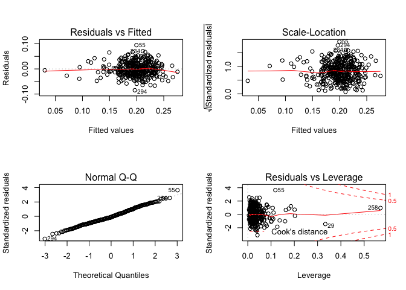

DA485\_Capstone2
================
Diana Spence
May 17, 2019

``` r
#load training
dir <- "data"
train_doc <- "train_data.csv"

training <- read_csv(here::here(dir,train_doc)) %>% 
  dplyr::select(-contains("X"), -id)
```

    ## Parsed with column specification:
    ## cols(
    ##   .default = col_double(),
    ##   institution_name = col_character(),
    ##   basic = col_character()
    ## )

    ## See spec(...) for full column specifications.

``` r
#training <-read.csv("train_data.csv", header = TRUE, sep = ",", stringsAsFactors = TRUE)
head(training, 5) ##Change to one name
```

    ## # A tibble: 5 x 14
    ##   institution_name basic grad_rate student_count spending_per_aw…
    ##   <chr>            <chr>     <dbl>         <dbl>            <dbl>
    ## 1 Broward College  Asso…     0.207         43883            23811
    ## 2 Texas State Uni… Mast…     0.217         31005            42278
    ## 3 University of H… Mast…     0.323          2889            36332
    ## 4 College of Will… Rese…     0.251          6271            80906
    ## 5 University of N… Mast…     0.173          5429            57497
    ## # … with 9 more variables: full_time_pct <dbl>, full_time_count <dbl>,
    ## #   med_sat_value <dbl>, aid_value <dbl>, endow_value <dbl>,
    ## #   grad_on_time_pct <dbl>, pell_value <dbl>, fresh_retain_value <dbl>,
    ## #   full_time_fac_pct <dbl>

\#Initial
correlation

``` r
##Took out the columns in Training that where not needed for the regression
#training <- training[,3:19]

#cor(training[,4:14])

initial_plot_data <- training %>% 
  dplyr::select(-institution_name, -basic)

cor(initial_plot_data)
```

    ##                      grad_rate student_count spending_per_award
    ## grad_rate           1.00000000    0.29502708        -0.37227068
    ## student_count       0.29502708    1.00000000        -0.15865345
    ## spending_per_award -0.37227068   -0.15865345         1.00000000
    ## full_time_pct       0.09883090   -0.03601739         0.16866285
    ## full_time_count     0.31476675    0.98234760        -0.12101355
    ## med_sat_value       0.22680814    0.32084574         0.09985182
    ## aid_value           0.18411348    0.11155272         0.19865037
    ## endow_value         0.05688165    0.17795312         0.13503089
    ## grad_on_time_pct    0.25872920    0.08105505         0.15113109
    ## pell_value         -0.27220741   -0.13685296         0.11300068
    ## fresh_retain_value  0.29409221    0.35625933        -0.15295193
    ## full_time_fac_pct  -0.05221259    0.01546441         0.17524975
    ##                    full_time_pct full_time_count med_sat_value  aid_value
    ## grad_rate             0.09883090      0.31476675    0.22680814 0.18411348
    ## student_count        -0.03601739      0.98234760    0.32084574 0.11155272
    ## spending_per_award    0.16866285     -0.12101355    0.09985182 0.19865037
    ## full_time_pct         1.00000000      0.08895538    0.19508616 0.46293775
    ## full_time_count       0.08895538      1.00000000    0.37456382 0.17548344
    ## med_sat_value         0.19508616      0.37456382    1.00000000 0.16998901
    ## aid_value             0.46293775      0.17548344    0.16998901 1.00000000
    ## endow_value           0.19189743      0.21794264    0.39968026 0.25933161
    ## grad_on_time_pct      0.63748303      0.18089769    0.54686825 0.40636802
    ## pell_value           -0.05691896     -0.15804335   -0.57148310 0.02657955
    ## fresh_retain_value    0.03244075      0.36375859    0.39883911 0.13122450
    ## full_time_fac_pct     0.58218233      0.10365099    0.20622672 0.25659594
    ##                    endow_value grad_on_time_pct   pell_value
    ## grad_rate           0.05688165       0.25872920 -0.272207410
    ## student_count       0.17795312       0.08105505 -0.136852957
    ## spending_per_award  0.13503089       0.15113109  0.113000679
    ## full_time_pct       0.19189743       0.63748303 -0.056918960
    ## full_time_count     0.21794264       0.18089769 -0.158043351
    ## med_sat_value       0.39968026       0.54686825 -0.571483105
    ## aid_value           0.25933161       0.40636802  0.026579551
    ## endow_value         1.00000000       0.36815997 -0.238097433
    ## grad_on_time_pct    0.36815997       1.00000000 -0.495451189
    ## pell_value         -0.23809743      -0.49545119  1.000000000
    ## fresh_retain_value  0.13027960       0.23619096 -0.353952985
    ## full_time_fac_pct   0.27877990       0.40664101 -0.002722845
    ##                    fresh_retain_value full_time_fac_pct
    ## grad_rate                  0.29409221      -0.052212594
    ## student_count              0.35625933       0.015464412
    ## spending_per_award        -0.15295193       0.175249754
    ## full_time_pct              0.03244075       0.582182331
    ## full_time_count            0.36375859       0.103650985
    ## med_sat_value              0.39883911       0.206226720
    ## aid_value                  0.13122450       0.256595940
    ## endow_value                0.13027960       0.278779896
    ## grad_on_time_pct           0.23619096       0.406641008
    ## pell_value                -0.35395299      -0.002722845
    ## fresh_retain_value         1.00000000      -0.059166073
    ## full_time_fac_pct         -0.05916607       1.000000000

``` r
##Scatterplots for the independent variables 
plot(initial_plot_data)
```

<!-- -->

``` r
##This function gives us a visual representation
##Important to note that the visual rounds numbers to the first decimal
ggcorr(initial_plot_data, 
       label = TRUE, 
       label_alpha = TRUE)
```

<!-- -->

To start the data is loaded into R and we are looking at the correlation
between `grad_rate` and the variables we have. We can see that
`student_count` and `full_time_count` have a high correlation of .98
although on the visual it shows a perfect 1. We have decided to keep
them and see how modeling the data deals with these two highly
correlated varibles. We think that they are both important to predicting
the graduation rate of colleges.

# Modeling

## Model 1: Base model

Model with all the variables: `student_count`, `spending_per_award`,
`full_time_pct`, `full_time_count`, `med_sat_value+aid_value`,
`endow_value`, `grad_on_time_pct+pell_value`, `fresh_retain_value`,
`full_time_fac_pct`.

``` r
##All data included this model has 11 independent variables
model.1 <- lm(grad_rate ~ student_count +spending_per_award +full_time_pct
             +full_time_count +med_sat_value +aid_value
             +endow_value +grad_on_time_pct +pell_value +fresh_retain_value
             + full_time_fac_pct,
             data = training)

##Model summary for model 1
summary(model.1)
```

    ## 
    ## Call:
    ## lm(formula = grad_rate ~ student_count + spending_per_award + 
    ##     full_time_pct + full_time_count + med_sat_value + aid_value + 
    ##     endow_value + grad_on_time_pct + pell_value + fresh_retain_value + 
    ##     full_time_fac_pct, data = training)
    ## 
    ## Residuals:
    ##       Min        1Q    Median        3Q       Max 
    ## -0.146868 -0.021255 -0.000941  0.018434  0.231189 
    ## 
    ## Coefficients:
    ##                      Estimate Std. Error t value Pr(>|t|)    
    ## (Intercept)         1.992e-01  3.792e-02   5.252 2.47e-07 ***
    ## student_count      -2.219e-06  1.609e-06  -1.379 0.168746    
    ## spending_per_award -5.426e-07  6.419e-08  -8.453 5.52e-16 ***
    ## full_time_pct      -1.104e-02  1.851e-02  -0.597 0.551038    
    ## full_time_count     3.711e-06  1.905e-06   1.948 0.052094 .  
    ## med_sat_value       1.172e-05  3.255e-05   0.360 0.718982    
    ## aid_value           3.590e-06  1.018e-06   3.528 0.000468 ***
    ## endow_value        -2.267e-07  1.763e-07  -1.285 0.199452    
    ## grad_on_time_pct    6.261e-02  2.194e-02   2.853 0.004557 ** 
    ## pell_value         -2.749e-02  2.108e-02  -1.304 0.193066    
    ## fresh_retain_value  2.225e-02  1.781e-02   1.249 0.212226    
    ## full_time_fac_pct  -3.279e-02  1.331e-02  -2.463 0.014186 *  
    ## ---
    ## Signif. codes:  0 '***' 0.001 '**' 0.01 '*' 0.05 '.' 0.1 ' ' 1
    ## 
    ## Residual standard error: 0.03847 on 395 degrees of freedom
    ## Multiple R-squared:  0.3352, Adjusted R-squared:  0.3167 
    ## F-statistic: 18.11 on 11 and 395 DF,  p-value: < 2.2e-16

``` r
# Diagnostic plots for model 1
layout(matrix(c(1,2,3,4),2,2)) # optional 4 graphs/page 
plot(model.1)
```

<!-- -->

``` r
##Standard regression
#stdres(model.1)

# Evaluate Collinearity with the variance inflation factor
vif(model.1) # variance inflation factors 
```

    ##      student_count spending_per_award      full_time_pct 
    ##          54.960697           1.190859           3.075292 
    ##    full_time_count      med_sat_value          aid_value 
    ##          56.476231           2.227180           1.468665 
    ##        endow_value   grad_on_time_pct         pell_value 
    ##           1.330764           3.179180           2.041594 
    ## fresh_retain_value  full_time_fac_pct 
    ##           1.395127           1.674067

``` r
sqrt(vif(model.1)) > 2.5 # I chose a 2.5 VIF based on article I read but this can be discussed
```

    ##      student_count spending_per_award      full_time_pct 
    ##               TRUE              FALSE              FALSE 
    ##    full_time_count      med_sat_value          aid_value 
    ##               TRUE              FALSE              FALSE 
    ##        endow_value   grad_on_time_pct         pell_value 
    ##              FALSE              FALSE              FALSE 
    ## fresh_retain_value  full_time_fac_pct 
    ##              FALSE              FALSE

When we run the regression model we get 4 significant variables and the
intercept is significant. We have an adjusted R^2 of %31.67 and a
significant p-value. Next by looking at the standard residuals we can
see that we don’t have very many of them therefore we can take out the
extremem outliers and still have enough observations to do further
modeling on the data that is remaining.

## Model 2: Outliers removed

With model 2 we have all the variables NO Interactions and have excluded
all the outliers.

``` r
# ##Training Data 
# data.2 <-read.csv("TrainingData_NO_Outliers.csv", header = TRUE, sep = ",", stringsAsFactors = TRUE)

# scrapping that to run residuals and filter using tidy-style code
training_without_outliers <- add_residuals(data = training,
                                           model = model.1,
                                           var = "resid") %>% 
  mutate(sdev = sd(resid),
                std.norm = resid / sdev,
                abs.std = abs(std.norm)) %>% #note: 407 rows at this point
   #dplyr::arrange(desc(abs.std)) %>% 
  filter(abs.std < 2)
```

``` r
model.2 <- lm(grad_rate ~ student_count + spending_per_award + full_time_pct + 
                        full_time_count + med_sat_value + aid_value + endow_value + 
                        grad_on_time_pct + pell_value + fresh_retain_value + full_time_fac_pct
                      ,data = training_without_outliers)

##Scatterplots for the independent variables
plot(training_without_outliers[,4:14])
```

<!-- -->

``` r
###Model summary
summary(model.2)
```

    ## 
    ## Call:
    ## lm(formula = grad_rate ~ student_count + spending_per_award + 
    ##     full_time_pct + full_time_count + med_sat_value + aid_value + 
    ##     endow_value + grad_on_time_pct + pell_value + fresh_retain_value + 
    ##     full_time_fac_pct, data = training_without_outliers)
    ## 
    ## Residuals:
    ##       Min        1Q    Median        3Q       Max 
    ## -0.075908 -0.018970 -0.002057  0.016410  0.076843 
    ## 
    ## Coefficients:
    ##                      Estimate Std. Error t value Pr(>|t|)    
    ## (Intercept)         1.840e-01  2.884e-02   6.379 5.26e-10 ***
    ## student_count      -8.412e-07  1.196e-06  -0.703 0.482221    
    ## spending_per_award -6.210e-07  5.048e-08 -12.301  < 2e-16 ***
    ## full_time_pct       6.528e-03  1.398e-02   0.467 0.640809    
    ## full_time_count     1.927e-06  1.417e-06   1.360 0.174614    
    ## med_sat_value       1.573e-05  2.419e-05   0.650 0.516106    
    ## aid_value           2.535e-06  7.632e-07   3.321 0.000985 ***
    ## endow_value        -1.009e-07  1.307e-07  -0.772 0.440560    
    ## grad_on_time_pct    8.017e-02  1.659e-02   4.832 1.98e-06 ***
    ## pell_value         -8.635e-03  1.579e-02  -0.547 0.584809    
    ## fresh_retain_value  2.190e-02  1.366e-02   1.604 0.109654    
    ## full_time_fac_pct  -3.424e-02  1.016e-02  -3.370 0.000831 ***
    ## ---
    ## Signif. codes:  0 '***' 0.001 '**' 0.01 '*' 0.05 '.' 0.1 ' ' 1
    ## 
    ## Residual standard error: 0.02821 on 375 degrees of freedom
    ## Multiple R-squared:  0.4978, Adjusted R-squared:  0.483 
    ## F-statistic: 33.79 on 11 and 375 DF,  p-value: < 2.2e-16

``` r
# Diagnostic plots 
layout(matrix(c(1,2,3,4),2,2)) # optional 4 graphs/page 
plot(model.2)
```

<!-- -->

``` r
# Evaluate Collinearity with the variance inflation factor
vif(model.2) # variance inflation factors 
```

    ##      student_count spending_per_award      full_time_pct 
    ##          54.538965           1.227208           3.124207 
    ##    full_time_count      med_sat_value          aid_value 
    ##          56.115476           2.226859           1.472561 
    ##        endow_value   grad_on_time_pct         pell_value 
    ##           1.354332           3.276682           2.066977 
    ## fresh_retain_value  full_time_fac_pct 
    ##           1.439539           1.683970

``` r
sqrt(vif(model.2)) > 2.5 # I chose a 2.5 VIF based on article I read but this can be discussed
```

    ##      student_count spending_per_award      full_time_pct 
    ##               TRUE              FALSE              FALSE 
    ##    full_time_count      med_sat_value          aid_value 
    ##               TRUE              FALSE              FALSE 
    ##        endow_value   grad_on_time_pct         pell_value 
    ##              FALSE              FALSE              FALSE 
    ## fresh_retain_value  full_time_fac_pct 
    ##              FALSE              FALSE

When we look at this model with the outliers taken out we get a better
p-values for same varibles as in Model 1 and an increased adjusted R^2
of 48.3% which is an improvement on Model 1. The p-value for the model
itself is still significant.

## Model 3: Trasformations

For model 3 we decided to transform some of the money values.

``` r
##Logging monetary values endow_value & pell_value
model.3 <- lm(grad_rate~student_count+spending_per_award+full_time_pct
             +full_time_count+med_sat_value+aid_value
             +log(endow_value)+grad_on_time_pct+log(pell_value)+fresh_retain_value+
             +full_time_fac_pct
             ,data = training_without_outliers)

###Model summary
summary(model.3)
```

    ## 
    ## Call:
    ## lm(formula = grad_rate ~ student_count + spending_per_award + 
    ##     full_time_pct + full_time_count + med_sat_value + aid_value + 
    ##     log(endow_value) + grad_on_time_pct + log(pell_value) + fresh_retain_value + 
    ##     +full_time_fac_pct, data = training_without_outliers)
    ## 
    ## Residuals:
    ##       Min        1Q    Median        3Q       Max 
    ## -0.074888 -0.018164 -0.001921  0.016171  0.081127 
    ## 
    ## Coefficients:
    ##                      Estimate Std. Error t value Pr(>|t|)    
    ## (Intercept)         1.788e-01  2.572e-02   6.953 1.60e-11 ***
    ## student_count      -7.932e-07  1.205e-06  -0.658 0.510701    
    ## spending_per_award -6.313e-07  4.962e-08 -12.723  < 2e-16 ***
    ## full_time_pct       5.812e-03  1.409e-02   0.413 0.680154    
    ## full_time_count     1.827e-06  1.428e-06   1.279 0.201714    
    ## med_sat_value       1.971e-05  2.396e-05   0.823 0.411281    
    ## aid_value           2.311e-06  7.589e-07   3.045 0.002494 ** 
    ## log(endow_value)    4.280e-05  1.377e-03   0.031 0.975230    
    ## grad_on_time_pct    8.564e-02  1.687e-02   5.077 6.06e-07 ***
    ## log(pell_value)     2.547e-03  5.998e-03   0.425 0.671294    
    ## fresh_retain_value  2.460e-02  1.392e-02   1.767 0.077979 .  
    ## full_time_fac_pct  -3.622e-02  1.025e-02  -3.534 0.000461 ***
    ## ---
    ## Signif. codes:  0 '***' 0.001 '**' 0.01 '*' 0.05 '.' 0.1 ' ' 1
    ## 
    ## Residual standard error: 0.02824 on 375 degrees of freedom
    ## Multiple R-squared:  0.4969, Adjusted R-squared:  0.4821 
    ## F-statistic: 33.66 on 11 and 375 DF,  p-value: < 2.2e-16

``` r
# Diagnostic plots 
layout(matrix(c(1,2,3,4),2,2)) # optional 4 graphs/page 
plot(model.3)
```

<!-- -->

``` r
# Evaluate Collinearity with the variance inflation factor
vif(model.3) # variance inflation factors 
```

    ##      student_count spending_per_award      full_time_pct 
    ##          55.253700           1.183407           3.166450 
    ##    full_time_count      med_sat_value          aid_value 
    ##          56.913233           2.180892           1.453322 
    ##   log(endow_value)   grad_on_time_pct    log(pell_value) 
    ##           1.447378           3.380104           2.049859 
    ## fresh_retain_value  full_time_fac_pct 
    ##           1.493283           1.710391

``` r
sqrt(vif(model.3)) > 2.5 # I chose a 2.5 VIF based on article I read but this can be discussed
```

    ##      student_count spending_per_award      full_time_pct 
    ##               TRUE              FALSE              FALSE 
    ##    full_time_count      med_sat_value          aid_value 
    ##               TRUE              FALSE              FALSE 
    ##   log(endow_value)   grad_on_time_pct    log(pell_value) 
    ##              FALSE              FALSE              FALSE 
    ## fresh_retain_value  full_time_fac_pct 
    ##              FALSE              FALSE

Two of the transformations were not feasable because they had 0 values
that could not be logged. We did log transformations of two variables
(endow\_value & pell\_value) and they made no significant difference.
Model 3’s adjusted R^2 decreased to 48.21% from 48.3% and the p-value
for aid\_value went from three stars of significance to two stars.
Because the changes did not add any substantial significance we will
keep the variables as they are with no treansformation. For Model 4 we
will introduce interactions without logging reverberating back to model
2.

## Model 4: Interactions w/No Outliers

Model 4 shows 5 interactions apart from the other 11 independent
variables. The ineractions that were added are:
endow\_value*spending\_per\_award (EndowXSpend),
pell\_value*med\_sat\_value (PellXSat),
fresh\_retain\_value*med\_sat\_value (RetainXSat),
aid\_value*med\_sat\_value (AidXSat), aid\_value\*endow\_value
(AidXEndow). For the EndowXSpend interaction we believe that the more
money the institutaion gets, the more they have, to spend on ways to
increase student success. The PellXSat ineraction is important because
you need to have and maintain a certain GPA to get a Pell Grant and
having high SAT scores indicates the ability to maintain a minimum GPA
to get and maintain the Pell Grant. For RetainXSat interaction we
believed that high SAT scores were a good indicator of your ability to
get throug freshman year of colleged. For AidXSat

``` r
##Model w/Interactions
model.4 <- lm(grad_rate~student_count+spending_per_award+full_time_pct
             +full_time_count+med_sat_value+aid_value
             +endow_value+grad_on_time_pct+pell_value+fresh_retain_value+
             +full_time_fac_pct
             +endow_value*spending_per_award     #EndowXSpend
             +pell_value*med_sat_value           #PellXSat
             +fresh_retain_value*med_sat_value   #RetainXSat
             +aid_value*med_sat_value            #AidXSat
             +aid_value*endow_value              #AidXEndow
             ,data = training_without_outliers)

###Model summary
summary(model.4)
```

    ## 
    ## Call:
    ## lm(formula = grad_rate ~ student_count + spending_per_award + 
    ##     full_time_pct + full_time_count + med_sat_value + aid_value + 
    ##     endow_value + grad_on_time_pct + pell_value + fresh_retain_value + 
    ##     +full_time_fac_pct + endow_value * spending_per_award + pell_value * 
    ##     med_sat_value + fresh_retain_value * med_sat_value + aid_value * 
    ##     med_sat_value + aid_value * endow_value, data = training_without_outliers)
    ## 
    ## Residuals:
    ##       Min        1Q    Median        3Q       Max 
    ## -0.075775 -0.017927 -0.002212  0.016964  0.079340 
    ## 
    ## Coefficients:
    ##                                    Estimate Std. Error t value Pr(>|t|)
    ## (Intercept)                       7.471e-01  1.986e-01   3.762 0.000196
    ## student_count                    -3.228e-07  1.175e-06  -0.275 0.783580
    ## spending_per_award               -8.066e-07  6.443e-08 -12.520  < 2e-16
    ## full_time_pct                     1.552e-02  1.394e-02   1.114 0.266133
    ## full_time_count                   1.196e-06  1.397e-06   0.857 0.392269
    ## med_sat_value                    -5.499e-04  1.996e-04  -2.756 0.006149
    ## aid_value                        -6.662e-06  7.158e-06  -0.931 0.352613
    ## endow_value                      -1.036e-06  7.390e-07  -1.401 0.161976
    ## grad_on_time_pct                  8.461e-02  1.651e-02   5.125 4.79e-07
    ## pell_value                       -4.160e-01  1.476e-01  -2.819 0.005083
    ## fresh_retain_value               -3.824e-01  2.188e-01  -1.748 0.081333
    ## full_time_fac_pct                -3.047e-02  1.009e-02  -3.019 0.002711
    ## spending_per_award:endow_value    2.769e-11  6.655e-12   4.160 3.96e-05
    ## med_sat_value:pell_value          4.102e-04  1.475e-04   2.782 0.005681
    ## med_sat_value:fresh_retain_value  4.075e-04  2.184e-04   1.866 0.062822
    ## med_sat_value:aid_value           9.669e-09  7.037e-09   1.374 0.170227
    ## aid_value:endow_value            -1.408e-10  6.508e-11  -2.164 0.031121
    ##                                     
    ## (Intercept)                      ***
    ## student_count                       
    ## spending_per_award               ***
    ## full_time_pct                       
    ## full_time_count                     
    ## med_sat_value                    ** 
    ## aid_value                           
    ## endow_value                         
    ## grad_on_time_pct                 ***
    ## pell_value                       ** 
    ## fresh_retain_value               .  
    ## full_time_fac_pct                ** 
    ## spending_per_award:endow_value   ***
    ## med_sat_value:pell_value         ** 
    ## med_sat_value:fresh_retain_value .  
    ## med_sat_value:aid_value             
    ## aid_value:endow_value            *  
    ## ---
    ## Signif. codes:  0 '***' 0.001 '**' 0.01 '*' 0.05 '.' 0.1 ' ' 1
    ## 
    ## Residual standard error: 0.02726 on 370 degrees of freedom
    ## Multiple R-squared:  0.5375, Adjusted R-squared:  0.5175 
    ## F-statistic: 26.87 on 16 and 370 DF,  p-value: < 2.2e-16

``` r
# Diagnostic plots 
layout(matrix(c(1,2,3,4),2,2)) # optional 4 graphs/page 
plot(model.4)
```

<!-- -->

``` r
# Evaluate Collinearity with the variance inflation factor
vif(model.4) # variance inflation factors 
```

    ##                    student_count               spending_per_award 
    ##                        56.363624                         2.141352 
    ##                    full_time_pct                  full_time_count 
    ##                         3.326594                        58.405206 
    ##                    med_sat_value                        aid_value 
    ##                       162.339086                       138.779745 
    ##                      endow_value                 grad_on_time_pct 
    ##                        46.377758                         3.474852 
    ##                       pell_value               fresh_retain_value 
    ##                       193.452415                       395.828286 
    ##                full_time_fac_pct   spending_per_award:endow_value 
    ##                         1.779131                        28.259832 
    ##         med_sat_value:pell_value med_sat_value:fresh_retain_value 
    ##                       147.803537                       706.336974 
    ##          med_sat_value:aid_value            aid_value:endow_value 
    ##                       174.487697                        33.540598

``` r
sqrt(vif(model.4)) > 2.5 # I chose a 2.5 VIF based on article I read but this can be discussed
```

    ##                    student_count               spending_per_award 
    ##                             TRUE                            FALSE 
    ##                    full_time_pct                  full_time_count 
    ##                            FALSE                             TRUE 
    ##                    med_sat_value                        aid_value 
    ##                             TRUE                             TRUE 
    ##                      endow_value                 grad_on_time_pct 
    ##                             TRUE                            FALSE 
    ##                       pell_value               fresh_retain_value 
    ##                             TRUE                             TRUE 
    ##                full_time_fac_pct   spending_per_award:endow_value 
    ##                            FALSE                             TRUE 
    ##         med_sat_value:pell_value med_sat_value:fresh_retain_value 
    ##                             TRUE                             TRUE 
    ##          med_sat_value:aid_value            aid_value:endow_value 
    ##                             TRUE                             TRUE

Based on this regression there are 16 independant variables in Model 4.
We have 8 variables that are significant plus the intercept, these
include: spending\_per\_award, med\_sat\_value, grad\_on\_time\_pct,
pell\_value11, full\_time\_fac\_pct, EndowXSpend, PellXSat, AidXEndow,
and the intercept. The adjusted R^2 increased to 51.75% from 48.3% and
the model p-value is still significant. Student\_count shows the highest
p-value at 0.783580 and therefore will be the first variable to be taken
out.

## Beginning backward elimination

### Model 5: student\_count removed

With this model we start backwards elimination. The first variable to go
is student\_count with a p-value 0.783580 baased on Model 4. The results
still show a significant intercept and 9 variables that are significant,
these include: spending\_per\_award, full\_time\_count, med\_sat\_value,
grad\_on\_time\_pct, pell\_value, full\_time\_fac\_pct, EndowXSpend,
PellXSat, AidXEndow. The variables full\_time\_count became significant.
The adjusted R^2 went up to 51.87% from 51.75% while the model is still
significant. The next variable to eleiminate is aid\_value with a
p-value of 0.345557 has the highest value for model 5.

``` r
## Model with interactions minus student_count
model.5 <- lm(grad_rate~spending_per_award+full_time_pct
             +full_time_count+med_sat_value+aid_value
             +endow_value+grad_on_time_pct+pell_value+fresh_retain_value+
             +full_time_fac_pct
             +endow_value*spending_per_award     #EndowXSpend
             +pell_value*med_sat_value           #PellXSat
             +fresh_retain_value*med_sat_value   #RetainXSat
             +aid_value*med_sat_value            #AidXSat
             +aid_value*endow_value              #AidXEndow
             ,data = training_without_outliers)

###Model summary
summary(model.5)
```

    ## 
    ## Call:
    ## lm(formula = grad_rate ~ spending_per_award + full_time_pct + 
    ##     full_time_count + med_sat_value + aid_value + endow_value + 
    ##     grad_on_time_pct + pell_value + fresh_retain_value + +full_time_fac_pct + 
    ##     endow_value * spending_per_award + pell_value * med_sat_value + 
    ##     fresh_retain_value * med_sat_value + aid_value * med_sat_value + 
    ##     aid_value * endow_value, data = training_without_outliers)
    ## 
    ## Residuals:
    ##       Min        1Q    Median        3Q       Max 
    ## -0.078702 -0.017825 -0.002131  0.017006  0.078363 
    ## 
    ## Coefficients:
    ##                                    Estimate Std. Error t value Pr(>|t|)
    ## (Intercept)                       7.534e-01  1.970e-01   3.824 0.000154
    ## spending_per_award               -8.055e-07  6.420e-08 -12.545  < 2e-16
    ## full_time_pct                     1.713e-02  1.264e-02   1.355 0.176191
    ## full_time_count                   8.171e-07  2.165e-07   3.774 0.000187
    ## med_sat_value                    -5.578e-04  1.973e-04  -2.828 0.004944
    ## aid_value                        -6.746e-06  7.143e-06  -0.944 0.345557
    ## endow_value                      -1.022e-06  7.364e-07  -1.387 0.166170
    ## grad_on_time_pct                  8.488e-02  1.646e-02   5.157 4.09e-07
    ## pell_value                       -4.201e-01  1.466e-01  -2.865 0.004410
    ## fresh_retain_value               -3.904e-01  2.166e-01  -1.803 0.072242
    ## full_time_fac_pct                -3.014e-02  1.001e-02  -3.011 0.002779
    ## spending_per_award:endow_value    2.762e-11  6.642e-12   4.158 3.99e-05
    ## med_sat_value:pell_value          4.145e-04  1.465e-04   2.830 0.004911
    ## med_sat_value:fresh_retain_value  4.155e-04  2.161e-04   1.923 0.055306
    ## med_sat_value:aid_value           9.756e-09  7.021e-09   1.390 0.165497
    ## aid_value:endow_value            -1.418e-10  6.491e-11  -2.184 0.029580
    ##                                     
    ## (Intercept)                      ***
    ## spending_per_award               ***
    ## full_time_pct                       
    ## full_time_count                  ***
    ## med_sat_value                    ** 
    ## aid_value                           
    ## endow_value                         
    ## grad_on_time_pct                 ***
    ## pell_value                       ** 
    ## fresh_retain_value               .  
    ## full_time_fac_pct                ** 
    ## spending_per_award:endow_value   ***
    ## med_sat_value:pell_value         ** 
    ## med_sat_value:fresh_retain_value .  
    ## med_sat_value:aid_value             
    ## aid_value:endow_value            *  
    ## ---
    ## Signif. codes:  0 '***' 0.001 '**' 0.01 '*' 0.05 '.' 0.1 ' ' 1
    ## 
    ## Residual standard error: 0.02722 on 371 degrees of freedom
    ## Multiple R-squared:  0.5374, Adjusted R-squared:  0.5187 
    ## F-statistic: 28.73 on 15 and 371 DF,  p-value: < 2.2e-16

``` r
# Diagnostic plots 
layout(matrix(c(1,2,3,4),2,2)) # optional 4 graphs/page 
plot(model.5)
```

<!-- -->

``` r
# Evaluate Collinearity with the variance inflation factor
vif(model.5) # variance inflation factors 
```

    ##               spending_per_award                    full_time_pct 
    ##                         2.131972                         2.742345 
    ##                  full_time_count                    med_sat_value 
    ##                         1.406928                       159.007387 
    ##                        aid_value                      endow_value 
    ##                       138.528027                        46.157690 
    ##                 grad_on_time_pct                       pell_value 
    ##                         3.462838                       191.459285 
    ##               fresh_retain_value                full_time_fac_pct 
    ##                       388.793851                         1.754987 
    ##   spending_per_award:endow_value         med_sat_value:pell_value 
    ##                        28.218285                       146.179061 
    ## med_sat_value:fresh_retain_value          med_sat_value:aid_value 
    ##                       693.691958                       174.138975 
    ##            aid_value:endow_value 
    ##                        33.446652

``` r
sqrt(vif(model.5)) > 2.5 # I chose a 2.5 VIF based on article I read but this can be discussed
```

    ##               spending_per_award                    full_time_pct 
    ##                            FALSE                            FALSE 
    ##                  full_time_count                    med_sat_value 
    ##                            FALSE                             TRUE 
    ##                        aid_value                      endow_value 
    ##                             TRUE                             TRUE 
    ##                 grad_on_time_pct                       pell_value 
    ##                            FALSE                             TRUE 
    ##               fresh_retain_value                full_time_fac_pct 
    ##                             TRUE                            FALSE 
    ##   spending_per_award:endow_value         med_sat_value:pell_value 
    ##                             TRUE                             TRUE 
    ## med_sat_value:fresh_retain_value          med_sat_value:aid_value 
    ##                             TRUE                             TRUE 
    ##            aid_value:endow_value 
    ##                             TRUE

### Model 6: aid\_value removed

With aid\_value taken out we run the model and it stil shows up in the
model because of the interactions all the same variables are significant
as before and our adjusted R^2 is 51.87 which is not different from
model 5.

``` r
## Model with interactions minus student_count & aid_value
model.6 <- lm(grad_rate~spending_per_award+full_time_pct
             +full_time_count+med_sat_value
             +endow_value+grad_on_time_pct+pell_value+fresh_retain_value+
             +full_time_fac_pct
             +endow_value*spending_per_award     #EndowXSpend
             +pell_value*med_sat_value           #PellXSat
             +fresh_retain_value*med_sat_value   #RetainXSat
             +aid_value*med_sat_value            #AidXSat
             +aid_value*endow_value              #AidXEndow
             ,data = training_without_outliers)

###Model summary
summary(model.6)
```

    ## 
    ## Call:
    ## lm(formula = grad_rate ~ spending_per_award + full_time_pct + 
    ##     full_time_count + med_sat_value + endow_value + grad_on_time_pct + 
    ##     pell_value + fresh_retain_value + +full_time_fac_pct + endow_value * 
    ##     spending_per_award + pell_value * med_sat_value + fresh_retain_value * 
    ##     med_sat_value + aid_value * med_sat_value + aid_value * endow_value, 
    ##     data = training_without_outliers)
    ## 
    ## Residuals:
    ##       Min        1Q    Median        3Q       Max 
    ## -0.078702 -0.017825 -0.002131  0.017006  0.078363 
    ## 
    ## Coefficients:
    ##                                    Estimate Std. Error t value Pr(>|t|)
    ## (Intercept)                       7.534e-01  1.970e-01   3.824 0.000154
    ## spending_per_award               -8.055e-07  6.420e-08 -12.545  < 2e-16
    ## full_time_pct                     1.713e-02  1.264e-02   1.355 0.176191
    ## full_time_count                   8.171e-07  2.165e-07   3.774 0.000187
    ## med_sat_value                    -5.578e-04  1.973e-04  -2.828 0.004944
    ## endow_value                      -1.022e-06  7.364e-07  -1.387 0.166170
    ## grad_on_time_pct                  8.488e-02  1.646e-02   5.157 4.09e-07
    ## pell_value                       -4.201e-01  1.466e-01  -2.865 0.004410
    ## fresh_retain_value               -3.904e-01  2.166e-01  -1.803 0.072242
    ## full_time_fac_pct                -3.014e-02  1.001e-02  -3.011 0.002779
    ## aid_value                        -6.746e-06  7.143e-06  -0.944 0.345557
    ## spending_per_award:endow_value    2.762e-11  6.642e-12   4.158 3.99e-05
    ## med_sat_value:pell_value          4.145e-04  1.465e-04   2.830 0.004911
    ## med_sat_value:fresh_retain_value  4.155e-04  2.161e-04   1.923 0.055306
    ## med_sat_value:aid_value           9.756e-09  7.021e-09   1.390 0.165497
    ## endow_value:aid_value            -1.418e-10  6.491e-11  -2.184 0.029580
    ##                                     
    ## (Intercept)                      ***
    ## spending_per_award               ***
    ## full_time_pct                       
    ## full_time_count                  ***
    ## med_sat_value                    ** 
    ## endow_value                         
    ## grad_on_time_pct                 ***
    ## pell_value                       ** 
    ## fresh_retain_value               .  
    ## full_time_fac_pct                ** 
    ## aid_value                           
    ## spending_per_award:endow_value   ***
    ## med_sat_value:pell_value         ** 
    ## med_sat_value:fresh_retain_value .  
    ## med_sat_value:aid_value             
    ## endow_value:aid_value            *  
    ## ---
    ## Signif. codes:  0 '***' 0.001 '**' 0.01 '*' 0.05 '.' 0.1 ' ' 1
    ## 
    ## Residual standard error: 0.02722 on 371 degrees of freedom
    ## Multiple R-squared:  0.5374, Adjusted R-squared:  0.5187 
    ## F-statistic: 28.73 on 15 and 371 DF,  p-value: < 2.2e-16

``` r
# Diagnostic plots 
layout(matrix(c(1,2,3,4),2,2)) # optional 4 graphs/page 
plot(model.6)
```

<!-- -->

``` r
# Evaluate Collinearity with the variance inflation factor
vif(model.6) # variance inflation factors 
```

    ##               spending_per_award                    full_time_pct 
    ##                         2.131972                         2.742345 
    ##                  full_time_count                    med_sat_value 
    ##                         1.406928                       159.007387 
    ##                      endow_value                 grad_on_time_pct 
    ##                        46.157690                         3.462838 
    ##                       pell_value               fresh_retain_value 
    ##                       191.459285                       388.793851 
    ##                full_time_fac_pct                        aid_value 
    ##                         1.754987                       138.528027 
    ##   spending_per_award:endow_value         med_sat_value:pell_value 
    ##                        28.218285                       146.179061 
    ## med_sat_value:fresh_retain_value          med_sat_value:aid_value 
    ##                       693.691958                       174.138975 
    ##            endow_value:aid_value 
    ##                        33.446652

``` r
sqrt(vif(model.6)) > 2.5 # I chose a 2.5 VIF based on article I read but this can be discussed
```

    ##               spending_per_award                    full_time_pct 
    ##                            FALSE                            FALSE 
    ##                  full_time_count                    med_sat_value 
    ##                            FALSE                             TRUE 
    ##                      endow_value                 grad_on_time_pct 
    ##                             TRUE                            FALSE 
    ##                       pell_value               fresh_retain_value 
    ##                             TRUE                             TRUE 
    ##                full_time_fac_pct                        aid_value 
    ##                            FALSE                             TRUE 
    ##   spending_per_award:endow_value         med_sat_value:pell_value 
    ##                             TRUE                             TRUE 
    ## med_sat_value:fresh_retain_value          med_sat_value:aid_value 
    ##                             TRUE                             TRUE 
    ##            endow_value:aid_value 
    ##                             TRUE

### Model 7: med\_sat\_value:aid\_value removed

For model 7 instead of taking full\_time\_pct out we decided to go with
med\_sat\_value:aid\_value as aid\_value still shows up in our model
because of the interactions. Med\_sat\_value, fresh\_retain\_value and
endow\_value became significant. Doing this decreases our adjusted R^2
to 51.75% from 51.87% but it gives us 12 significant variables and a
significant intercept. The next variable to delete is AidXEndow, and
this is because of the ineraction with aid\_value. We thought this would
be btter thank taking out the highest insifnificant p-value.This
ineractions p-value is 0.082648.

``` r
## Model with interactions minus student_count & aid_value
model.7 <- lm(grad_rate~spending_per_award+full_time_pct
             +full_time_count+med_sat_value
             +endow_value+grad_on_time_pct+pell_value+fresh_retain_value+
             +full_time_fac_pct
             +endow_value*spending_per_award     #EndowXSpend
             +pell_value*med_sat_value           #PellXSat
             +fresh_retain_value*med_sat_value   #RetainXSat
             +aid_value*endow_value              #AidXEndow
             ,data = training_without_outliers)

###Model summary
summary(model.7)
```

    ## 
    ## Call:
    ## lm(formula = grad_rate ~ spending_per_award + full_time_pct + 
    ##     full_time_count + med_sat_value + endow_value + grad_on_time_pct + 
    ##     pell_value + fresh_retain_value + +full_time_fac_pct + endow_value * 
    ##     spending_per_award + pell_value * med_sat_value + fresh_retain_value * 
    ##     med_sat_value + aid_value * endow_value, data = training_without_outliers)
    ## 
    ## Residuals:
    ##       Min        1Q    Median        3Q       Max 
    ## -0.079341 -0.017983 -0.002234  0.016312  0.078906 
    ## 
    ## Coefficients:
    ##                                    Estimate Std. Error t value Pr(>|t|)
    ## (Intercept)                       7.918e-01  1.953e-01   4.055 6.12e-05
    ## spending_per_award               -8.011e-07  6.421e-08 -12.477  < 2e-16
    ## full_time_pct                     1.584e-02  1.262e-02   1.255 0.210351
    ## full_time_count                   8.003e-07  2.165e-07   3.698 0.000250
    ## med_sat_value                    -5.964e-04  1.955e-04  -3.050 0.002452
    ## endow_value                      -1.375e-06  6.919e-07  -1.988 0.047566
    ## grad_on_time_pct                  8.470e-02  1.648e-02   5.140 4.45e-07
    ## pell_value                       -4.829e-01  1.397e-01  -3.457 0.000610
    ## fresh_retain_value               -5.016e-01  2.015e-01  -2.490 0.013218
    ## full_time_fac_pct                -2.851e-02  9.953e-03  -2.865 0.004410
    ## aid_value                         3.111e-06  8.379e-07   3.713 0.000236
    ## spending_per_award:endow_value    2.782e-11  6.649e-12   4.184 3.57e-05
    ## med_sat_value:pell_value          4.772e-04  1.395e-04   3.420 0.000696
    ## med_sat_value:fresh_retain_value  5.264e-04  2.011e-04   2.617 0.009229
    ## endow_value:aid_value            -1.007e-10  5.786e-11  -1.740 0.082648
    ##                                     
    ## (Intercept)                      ***
    ## spending_per_award               ***
    ## full_time_pct                       
    ## full_time_count                  ***
    ## med_sat_value                    ** 
    ## endow_value                      *  
    ## grad_on_time_pct                 ***
    ## pell_value                       ***
    ## fresh_retain_value               *  
    ## full_time_fac_pct                ** 
    ## aid_value                        ***
    ## spending_per_award:endow_value   ***
    ## med_sat_value:pell_value         ***
    ## med_sat_value:fresh_retain_value ** 
    ## endow_value:aid_value            .  
    ## ---
    ## Signif. codes:  0 '***' 0.001 '**' 0.01 '*' 0.05 '.' 0.1 ' ' 1
    ## 
    ## Residual standard error: 0.02726 on 372 degrees of freedom
    ## Multiple R-squared:  0.535,  Adjusted R-squared:  0.5175 
    ## F-statistic: 30.57 on 14 and 372 DF,  p-value: < 2.2e-16

``` r
# Diagnostic plots 
layout(matrix(c(1,2,3,4),2,2)) # optional 4 graphs/page 
plot(model.7)
```

<!-- -->

``` r
# Evaluate Collinearity with the variance inflation factor
vif(model.7) # variance inflation factors 
```

    ##               spending_per_award                    full_time_pct 
    ##                         2.126869                         2.727502 
    ##                  full_time_count                    med_sat_value 
    ##                         1.402565                       155.849332 
    ##                      endow_value                 grad_on_time_pct 
    ##                        40.643507                         3.462631 
    ##                       pell_value               fresh_retain_value 
    ##                       173.298775                       335.674046 
    ##                full_time_fac_pct                        aid_value 
    ##                         1.730896                         1.901528 
    ##   spending_per_award:endow_value         med_sat_value:pell_value 
    ##                        28.204409                       132.311926 
    ## med_sat_value:fresh_retain_value            endow_value:aid_value 
    ##                       599.190474                        26.505731

``` r
sqrt(vif(model.7)) > 2.5 # I chose a 2.5 VIF based on article I read but this can be discussed
```

    ##               spending_per_award                    full_time_pct 
    ##                            FALSE                            FALSE 
    ##                  full_time_count                    med_sat_value 
    ##                            FALSE                             TRUE 
    ##                      endow_value                 grad_on_time_pct 
    ##                             TRUE                            FALSE 
    ##                       pell_value               fresh_retain_value 
    ##                             TRUE                             TRUE 
    ##                full_time_fac_pct                        aid_value 
    ##                            FALSE                            FALSE 
    ##   spending_per_award:endow_value         med_sat_value:pell_value 
    ##                             TRUE                             TRUE 
    ## med_sat_value:fresh_retain_value            endow_value:aid_value 
    ##                             TRUE                             TRUE

### Model 8:AidXEndow removed

Took out AidXEndow and the results are as follows: All remaining
variables are significant and the adjusted R^2 is 50.22% from 51.75%.
The model p-value is still significant.

``` r
## Model with interactions minus student_count & aid_value
model.8 <- lm(grad_rate~spending_per_award+full_time_pct
             +full_time_count+med_sat_value
             +endow_value+grad_on_time_pct+pell_value+fresh_retain_value+
             +full_time_fac_pct
             +endow_value*spending_per_award     #EndowXSpend
             +pell_value*med_sat_value           #PellXSat
             +fresh_retain_value*med_sat_value   #RetainXSat
             ,data = training_without_outliers)

###Model summary
summary(model.8)
```

    ## 
    ## Call:
    ## lm(formula = grad_rate ~ spending_per_award + full_time_pct + 
    ##     full_time_count + med_sat_value + endow_value + grad_on_time_pct + 
    ##     pell_value + fresh_retain_value + +full_time_fac_pct + endow_value * 
    ##     spending_per_award + pell_value * med_sat_value + fresh_retain_value * 
    ##     med_sat_value, data = training_without_outliers)
    ## 
    ## Residuals:
    ##       Min        1Q    Median        3Q       Max 
    ## -0.084638 -0.017830 -0.002937  0.017604  0.094458 
    ## 
    ## Coefficients:
    ##                                    Estimate Std. Error t value Pr(>|t|)
    ## (Intercept)                       8.113e-01  1.972e-01   4.114 4.78e-05
    ## spending_per_award               -7.657e-07  6.411e-08 -11.944  < 2e-16
    ## full_time_pct                     2.850e-02  1.234e-02   2.310 0.021435
    ## full_time_count                   9.112e-07  2.173e-07   4.193 3.45e-05
    ## med_sat_value                    -6.143e-04  1.973e-04  -3.113 0.001991
    ## endow_value                      -2.084e-06  5.566e-07  -3.744 0.000209
    ## grad_on_time_pct                  8.940e-02  1.649e-02   5.421 1.07e-07
    ## pell_value                       -5.024e-01  1.410e-01  -3.562 0.000416
    ## fresh_retain_value               -5.049e-01  2.019e-01  -2.501 0.012818
    ## full_time_fac_pct                -2.919e-02  1.000e-02  -2.919 0.003725
    ## spending_per_award:endow_value    2.617e-11  6.652e-12   3.935 9.93e-05
    ## med_sat_value:pell_value          5.052e-04  1.409e-04   3.585 0.000381
    ## med_sat_value:fresh_retain_value  5.327e-04  2.013e-04   2.647 0.008475
    ##                                     
    ## (Intercept)                      ***
    ## spending_per_award               ***
    ## full_time_pct                    *  
    ## full_time_count                  ***
    ## med_sat_value                    ** 
    ## endow_value                      ***
    ## grad_on_time_pct                 ***
    ## pell_value                       ***
    ## fresh_retain_value               *  
    ## full_time_fac_pct                ** 
    ## spending_per_award:endow_value   ***
    ## med_sat_value:pell_value         ***
    ## med_sat_value:fresh_retain_value ** 
    ## ---
    ## Signif. codes:  0 '***' 0.001 '**' 0.01 '*' 0.05 '.' 0.1 ' ' 1
    ## 
    ## Residual standard error: 0.02768 on 374 degrees of freedom
    ## Multiple R-squared:  0.5177, Adjusted R-squared:  0.5022 
    ## F-statistic: 33.46 on 12 and 374 DF,  p-value: < 2.2e-16

``` r
# Diagnostic plots 
layout(matrix(c(1,2,3,4),2,2)) # optional 4 graphs/page 
plot(model.8)
```

<!-- -->

``` r
# Evaluate Collinearity with the variance inflation factor
vif(model.8) # variance inflation factors 
```

    ##               spending_per_award                    full_time_pct 
    ##                         2.055491                         2.527968 
    ##                  full_time_count                    med_sat_value 
    ##                         1.370784                       153.820334 
    ##                      endow_value                 grad_on_time_pct 
    ##                        25.506048                         3.361304 
    ##                       pell_value               fresh_retain_value 
    ##                       171.289419                       326.720380 
    ##                full_time_fac_pct   spending_per_award:endow_value 
    ##                         1.693938                        27.367099 
    ##         med_sat_value:pell_value med_sat_value:fresh_retain_value 
    ##                       130.849472                       581.855476

``` r
sqrt(vif(model.8)) > 2.5 # I chose a 2.5 VIF based on article I read but this can be discussed
```

    ##               spending_per_award                    full_time_pct 
    ##                            FALSE                            FALSE 
    ##                  full_time_count                    med_sat_value 
    ##                            FALSE                             TRUE 
    ##                      endow_value                 grad_on_time_pct 
    ##                             TRUE                            FALSE 
    ##                       pell_value               fresh_retain_value 
    ##                             TRUE                             TRUE 
    ##                full_time_fac_pct   spending_per_award:endow_value 
    ##                            FALSE                             TRUE 
    ##         med_sat_value:pell_value med_sat_value:fresh_retain_value 
    ##                             TRUE                             TRUE

### Model 9: full\_time\_percent removed

To see if we could get all our independent varibles and interactions at
a better significance level we decided to take full\_time\_percent out
to see what it did to the model. The results show that the adjusted R^2
lowered a bit to 49.65 from 50.22% the model p-value still shows a
significant level p-value. to see if we could increase the p-value to
better significance level the next variable to take out was
full\_time\_fac\_pct it has highest significant p-value and the
coefficient is negative which is counterintuiative.

``` r
## Model with interactions minus student_count & aid_value
model.9 <- lm(grad_rate~spending_per_award
             +full_time_count+med_sat_value
             +endow_value+grad_on_time_pct+pell_value+fresh_retain_value+
             +full_time_fac_pct
             +endow_value*spending_per_award     #EndowXSpend
             +pell_value*med_sat_value           #PellXSat
             +fresh_retain_value*med_sat_value   #RetainXSat
             ,data = training_without_outliers)

###Model summary
summary(model.9)
```

    ## 
    ## Call:
    ## lm(formula = grad_rate ~ spending_per_award + full_time_count + 
    ##     med_sat_value + endow_value + grad_on_time_pct + pell_value + 
    ##     fresh_retain_value + +full_time_fac_pct + endow_value * spending_per_award + 
    ##     pell_value * med_sat_value + fresh_retain_value * med_sat_value, 
    ##     data = training_without_outliers)
    ## 
    ## Residuals:
    ##       Min        1Q    Median        3Q       Max 
    ## -0.091079 -0.018339 -0.002864  0.017520  0.089200 
    ## 
    ## Coefficients:
    ##                                    Estimate Std. Error t value Pr(>|t|)
    ## (Intercept)                       7.590e-01  1.970e-01   3.853 0.000137
    ## spending_per_award               -7.593e-07  6.442e-08 -11.787  < 2e-16
    ## full_time_count                   9.428e-07  2.181e-07   4.322 1.99e-05
    ## med_sat_value                    -5.543e-04  1.967e-04  -2.818 0.005089
    ## endow_value                      -2.075e-06  5.598e-07  -3.706 0.000242
    ## grad_on_time_pct                  1.124e-01  1.323e-02   8.492 4.83e-16
    ## pell_value                       -4.510e-01  1.401e-01  -3.220 0.001395
    ## fresh_retain_value               -4.430e-01  2.012e-01  -2.201 0.028310
    ## full_time_fac_pct                -2.022e-02  9.270e-03  -2.182 0.029740
    ## spending_per_award:endow_value    2.565e-11  6.686e-12   3.837 0.000146
    ## med_sat_value:pell_value          4.620e-04  1.405e-04   3.289 0.001101
    ## med_sat_value:fresh_retain_value  4.705e-04  2.006e-04   2.345 0.019538
    ##                                     
    ## (Intercept)                      ***
    ## spending_per_award               ***
    ## full_time_count                  ***
    ## med_sat_value                    ** 
    ## endow_value                      ***
    ## grad_on_time_pct                 ***
    ## pell_value                       ** 
    ## fresh_retain_value               *  
    ## full_time_fac_pct                *  
    ## spending_per_award:endow_value   ***
    ## med_sat_value:pell_value         ** 
    ## med_sat_value:fresh_retain_value *  
    ## ---
    ## Signif. codes:  0 '***' 0.001 '**' 0.01 '*' 0.05 '.' 0.1 ' ' 1
    ## 
    ## Residual standard error: 0.02784 on 375 degrees of freedom
    ## Multiple R-squared:  0.5108, Adjusted R-squared:  0.4965 
    ## F-statistic:  35.6 on 11 and 375 DF,  p-value: < 2.2e-16

``` r
# Diagnostic plots 
layout(matrix(c(1,2,3,4),2,2)) # optional 4 graphs/page 
plot(model.9)
```

<!-- -->

``` r
# Evaluate Collinearity with the variance inflation factor
vif(model.9) # variance inflation factors 
```

    ##               spending_per_award                  full_time_count 
    ##                         2.051620                         1.365352 
    ##                    med_sat_value                      endow_value 
    ##                       151.157629                        25.504655 
    ##                 grad_on_time_pct                       pell_value 
    ##                         2.139431                       167.032959 
    ##               fresh_retain_value                full_time_fac_pct 
    ##                       320.980229                         1.438816 
    ##   spending_per_award:endow_value         med_sat_value:pell_value 
    ##                        27.335810                       128.541016 
    ## med_sat_value:fresh_retain_value 
    ##                       571.438524

``` r
sqrt(vif(model.9)) > 2.5 # I chose a 2.5 VIF based on article I read but this can be discussed
```

    ##               spending_per_award                  full_time_count 
    ##                            FALSE                            FALSE 
    ##                    med_sat_value                      endow_value 
    ##                             TRUE                             TRUE 
    ##                 grad_on_time_pct                       pell_value 
    ##                            FALSE                             TRUE 
    ##               fresh_retain_value                full_time_fac_pct 
    ##                             TRUE                            FALSE 
    ##   spending_per_award:endow_value         med_sat_value:pell_value 
    ##                             TRUE                             TRUE 
    ## med_sat_value:fresh_retain_value 
    ##                             TRUE

### Model 10

At this point all the variables and interactions are significant at
alpha = 0.5 The adjusted R^2 for Model 10 is49.15% sligthly down from
Model 9’s 49.65 not too bad of a difference between the models.

``` r
## Model with interactions minus student_count & aid_value
model.10 <- lm(grad_rate~spending_per_award
             +full_time_count+med_sat_value
             +endow_value+grad_on_time_pct+pell_value+fresh_retain_value
             +endow_value*spending_per_award     #EndowXSpend
             +pell_value*med_sat_value           #PellXSat
             +fresh_retain_value*med_sat_value   #RetainXSat
             ,data = training_without_outliers)

###Model summary
summary(model.10)
```

    ## 
    ## Call:
    ## lm(formula = grad_rate ~ spending_per_award + full_time_count + 
    ##     med_sat_value + endow_value + grad_on_time_pct + pell_value + 
    ##     fresh_retain_value + endow_value * spending_per_award + pell_value * 
    ##     med_sat_value + fresh_retain_value * med_sat_value, data = training_without_outliers)
    ## 
    ## Residuals:
    ##       Min        1Q    Median        3Q       Max 
    ## -0.090583 -0.019322 -0.002423  0.018602  0.099142 
    ## 
    ## Coefficients:
    ##                                    Estimate Std. Error t value Pr(>|t|)
    ## (Intercept)                       8.082e-01  1.967e-01   4.109 4.89e-05
    ## spending_per_award               -7.724e-07  6.446e-08 -11.982  < 2e-16
    ## full_time_count                   9.008e-07  2.184e-07   4.125 4.57e-05
    ## med_sat_value                    -6.143e-04  1.958e-04  -3.138 0.001834
    ## endow_value                      -2.216e-06  5.588e-07  -3.965 8.77e-05
    ## grad_on_time_pct                  1.030e-01  1.257e-02   8.189 4.15e-15
    ## pell_value                       -5.199e-01  1.372e-01  -3.790 0.000175
    ## fresh_retain_value               -4.762e-01  2.017e-01  -2.361 0.018733
    ## spending_per_award:endow_value    2.709e-11  6.687e-12   4.051 6.21e-05
    ## med_sat_value:pell_value          5.257e-04  1.381e-04   3.807 0.000164
    ## med_sat_value:fresh_retain_value  5.096e-04  2.008e-04   2.538 0.011566
    ##                                     
    ## (Intercept)                      ***
    ## spending_per_award               ***
    ## full_time_count                  ***
    ## med_sat_value                    ** 
    ## endow_value                      ***
    ## grad_on_time_pct                 ***
    ## pell_value                       ***
    ## fresh_retain_value               *  
    ## spending_per_award:endow_value   ***
    ## med_sat_value:pell_value         ***
    ## med_sat_value:fresh_retain_value *  
    ## ---
    ## Signif. codes:  0 '***' 0.001 '**' 0.01 '*' 0.05 '.' 0.1 ' ' 1
    ## 
    ## Residual standard error: 0.02798 on 376 degrees of freedom
    ## Multiple R-squared:  0.5046, Adjusted R-squared:  0.4915 
    ## F-statistic:  38.3 on 10 and 376 DF,  p-value: < 2.2e-16

``` r
# Diagnostic plots 
layout(matrix(c(1,2,3,4),2,2)) # optional 4 graphs/page 
plot(model.10)
```

<!-- -->

``` r
# Evaluate Collinearity with the variance inflation factor
vif(model.10) # variance inflation factors 
```

    ##               spending_per_award                  full_time_count 
    ##                         2.033843                         1.354716 
    ##                    med_sat_value                      endow_value 
    ##                       148.205587                        25.162679 
    ##                 grad_on_time_pct                       pell_value 
    ##                         1.912017                       158.563534 
    ##               fresh_retain_value   spending_per_award:endow_value 
    ##                       319.153909                        27.071485 
    ##         med_sat_value:pell_value med_sat_value:fresh_retain_value 
    ##                       122.987221                       566.880982

``` r
sqrt(vif(model.10)) > 2.5 # I chose a 2.5 VIF based on article I read but this can be discussed
```

    ##               spending_per_award                  full_time_count 
    ##                            FALSE                            FALSE 
    ##                    med_sat_value                      endow_value 
    ##                             TRUE                             TRUE 
    ##                 grad_on_time_pct                       pell_value 
    ##                            FALSE                             TRUE 
    ##               fresh_retain_value   spending_per_award:endow_value 
    ##                             TRUE                             TRUE 
    ##         med_sat_value:pell_value med_sat_value:fresh_retain_value 
    ##                             TRUE                             TRUE

# Summary

Model 10 is the model that we should go with. If we keep going as you
can see the models adjusted R^2 just keeps getting slightly worse than
the previous model’s adjusted R^2 and the p-values of the interactions
and independent variables don’t show a significant enough change to
continue with further backwards elemination. Testing the assumptions for
model 10:

1.  Linearity of the data:

<!-- end list -->

  - The linearity assumption can be checked by inspecting the Residuals
    vs Fitted.In our example, there is no pattern in the residual plot.
    This suggests that we can assume linear relationship between the
    predictors and the outcome variables.

<!-- end list -->

2.  Homogeneity of variance:

<!-- end list -->

  - This assumption can be checked by examining the scale-location
    plot.This plot shows if residuals are spread equally along the
    ranges of predictors. It’s good that you can see the horizontal line
    with equally spread points.

<!-- end list -->

3.  Normality of residuals:

<!-- end list -->

  - The QQ plot of residuals can be used to visually check the normality
    assumption. The normal probability plot of residuals should
    approximately follow a straight line. In our example, all the points
    fall approximately along this reference line, so we can assume
    normality.

<!-- end list -->

4.  Independence of residuals error terms:

<!-- end list -->

  - In our Model 10 plot, the data doesn’t present any influential
    points. Cook’s distance lines (a red dashed line) are not shown on
    the Residuals vs Leverage plot because all points are well inside of
    the Cook’s distance lines.

-----

## Other models

### Model 11: med\_sat\_value:fresh\_retain\_value taken out

``` r
## Model with interactions minus student_count & aid_value
model.11 <- lm(grad_rate~spending_per_award
             +full_time_count+med_sat_value
             +endow_value+grad_on_time_pct+pell_value+fresh_retain_value
             +endow_value*spending_per_award     #EndowXSpend
             +pell_value*med_sat_value           #PellXSat
             ,data = training_without_outliers)

##Summary for the model
summary(model.11)
```

    ## 
    ## Call:
    ## lm(formula = grad_rate ~ spending_per_award + full_time_count + 
    ##     med_sat_value + endow_value + grad_on_time_pct + pell_value + 
    ##     fresh_retain_value + endow_value * spending_per_award + pell_value * 
    ##     med_sat_value, data = training_without_outliers)
    ## 
    ## Residuals:
    ##       Min        1Q    Median        3Q       Max 
    ## -0.089531 -0.018835 -0.002984  0.019467  0.097125 
    ## 
    ## Coefficients:
    ##                                  Estimate Std. Error t value Pr(>|t|)    
    ## (Intercept)                     3.274e-01  5.334e-02   6.139 2.11e-09 ***
    ## spending_per_award             -7.670e-07  6.489e-08 -11.821  < 2e-16 ***
    ## full_time_count                 9.518e-07  2.190e-07   4.346 1.79e-05 ***
    ## med_sat_value                  -1.367e-04  5.424e-05  -2.521  0.01212 *  
    ## endow_value                    -2.226e-06  5.628e-07  -3.955 9.15e-05 ***
    ## grad_on_time_pct                1.074e-01  1.254e-02   8.565 2.79e-16 ***
    ## pell_value                     -3.253e-01  1.146e-01  -2.840  0.00476 ** 
    ## fresh_retain_value              3.445e-02  1.360e-02   2.533  0.01170 *  
    ## spending_per_award:endow_value  2.749e-11  6.733e-12   4.083 5.43e-05 ***
    ## med_sat_value:pell_value        3.341e-04  1.165e-04   2.869  0.00435 ** 
    ## ---
    ## Signif. codes:  0 '***' 0.001 '**' 0.01 '*' 0.05 '.' 0.1 ' ' 1
    ## 
    ## Residual standard error: 0.02818 on 377 degrees of freedom
    ## Multiple R-squared:  0.4961, Adjusted R-squared:  0.4841 
    ## F-statistic: 41.25 on 9 and 377 DF,  p-value: < 2.2e-16

### Model 12: Fresh retain value is out

``` r
## Model 
model.12 <- lm(grad_rate~spending_per_award
              +full_time_count+med_sat_value
              +endow_value+grad_on_time_pct+pell_value
              +endow_value*spending_per_award     #EndowXSpend
              +pell_value*med_sat_value           #PellXSat
              ,data = training_without_outliers)

##Summary for the model
summary(model.12)
```

    ## 
    ## Call:
    ## lm(formula = grad_rate ~ spending_per_award + full_time_count + 
    ##     med_sat_value + endow_value + grad_on_time_pct + pell_value + 
    ##     endow_value * spending_per_award + pell_value * med_sat_value, 
    ##     data = training_without_outliers)
    ## 
    ## Residuals:
    ##       Min        1Q    Median        3Q       Max 
    ## -0.083686 -0.019831 -0.002652  0.021731  0.080008 
    ## 
    ## Coefficients:
    ##                                  Estimate Std. Error t value Pr(>|t|)    
    ## (Intercept)                     3.277e-01  5.372e-02   6.099 2.63e-09 ***
    ## spending_per_award             -7.926e-07  6.455e-08 -12.279  < 2e-16 ***
    ## full_time_count                 1.104e-06  2.122e-07   5.202 3.24e-07 ***
    ## med_sat_value                  -1.077e-04  5.339e-05  -2.016   0.0445 *  
    ## endow_value                    -2.417e-06  5.618e-07  -4.302 2.16e-05 ***
    ## grad_on_time_pct                1.069e-01  1.263e-02   8.464 5.77e-16 ***
    ## pell_value                     -2.863e-01  1.143e-01  -2.504   0.0127 *  
    ## spending_per_award:endow_value  2.938e-11  6.739e-12   4.360 1.68e-05 ***
    ## med_sat_value:pell_value        2.876e-04  1.158e-04   2.483   0.0135 *  
    ## ---
    ## Signif. codes:  0 '***' 0.001 '**' 0.01 '*' 0.05 '.' 0.1 ' ' 1
    ## 
    ## Residual standard error: 0.02838 on 378 degrees of freedom
    ## Multiple R-squared:  0.4876, Adjusted R-squared:  0.4767 
    ## F-statistic: 44.96 on 8 and 378 DF,  p-value: < 2.2e-16

-----

We have decided to go with Model 10 for ALL our predictions. We have

``` r
library(modelr)
##Predictions on the training with the extracted outliers
##adding them back to training_without_outliers with predictions
training_without_outliers <-add_predictions(training_without_outliers, model.10, var = "pred")

##Adds residuals to training_without_outliers dataframe
training_without_outliers <- add_residuals(training_without_outliers, model.10)
```

``` r
#Test dataset for Prediction
test_doc <- "train_data.csv"

testing <- read_csv(here::here(dir,test_doc)) %>% 
  dplyr::select(-contains("X"), -id)
```

    ## Parsed with column specification:
    ## cols(
    ##   .default = col_double(),
    ##   institution_name = col_character(),
    ##   basic = col_character()
    ## )

    ## See spec(...) for full column specifications.

``` r
#data.3 <- read.csv("test_data.csv", header = TRUE, sep = ",", stringsAsFactors = TRUE)

add_predictions(testing, model.10, var = "pred")
```

    ## # A tibble: 407 x 15
    ##    institution_name basic grad_rate student_count spending_per_aw…
    ##    <chr>            <chr>     <dbl>         <dbl>            <dbl>
    ##  1 Broward College  Asso…     0.207         43883            23811
    ##  2 Texas State Uni… Mast…     0.217         31005            42278
    ##  3 University of H… Mast…     0.323          2889            36332
    ##  4 College of Will… Rese…     0.251          6271            80906
    ##  5 University of N… Mast…     0.173          5429            57497
    ##  6 Eastern Washing… Mast…     0.211         11678            45343
    ##  7 West Chester Un… Mast…     0.214         13711            53890
    ##  8 St. Mary's Coll… Bacc…     0.22           1819           109456
    ##  9 University of W… Mast…     0.23           6445            45862
    ## 10 Dickinson State… Bacc…     0.229          1449            49919
    ## # … with 397 more rows, and 10 more variables: full_time_pct <dbl>,
    ## #   full_time_count <dbl>, med_sat_value <dbl>, aid_value <dbl>,
    ## #   endow_value <dbl>, grad_on_time_pct <dbl>, pell_value <dbl>,
    ## #   fresh_retain_value <dbl>, full_time_fac_pct <dbl>, pred <dbl>
