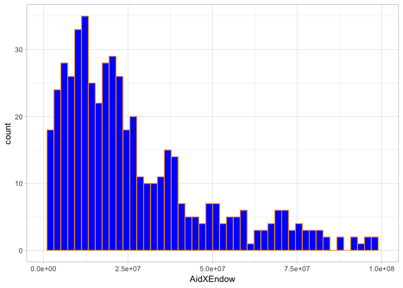
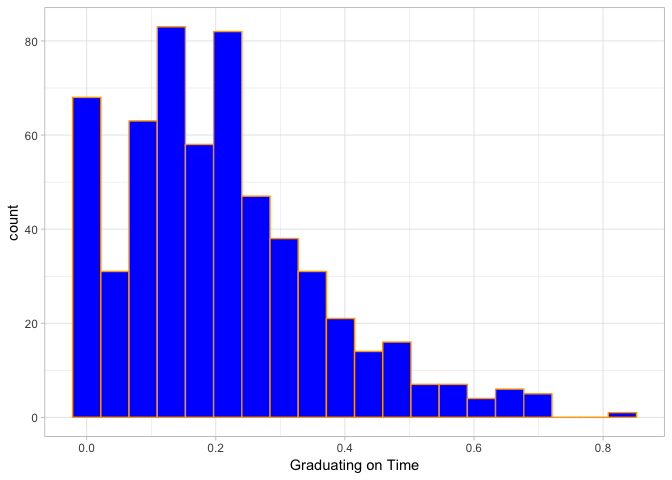
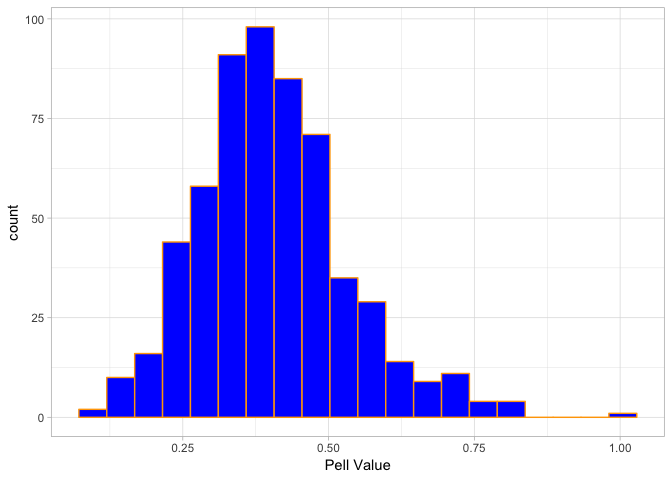
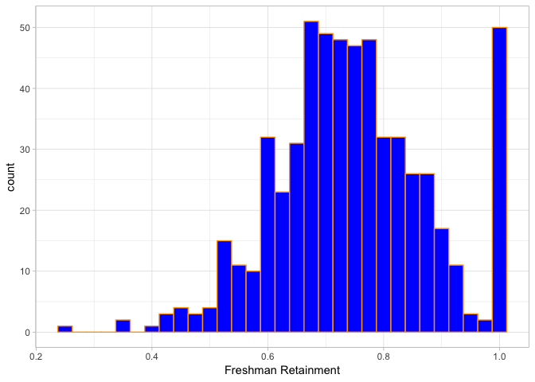
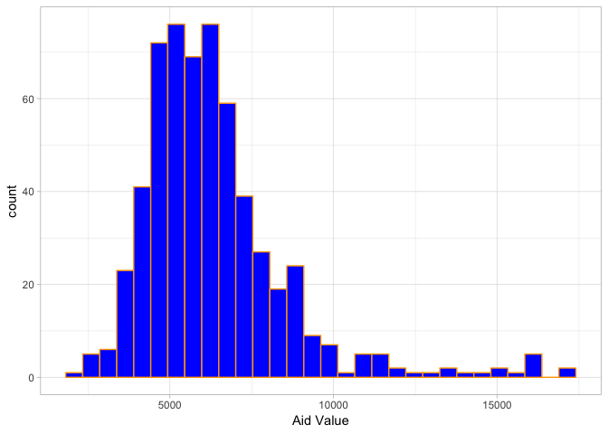
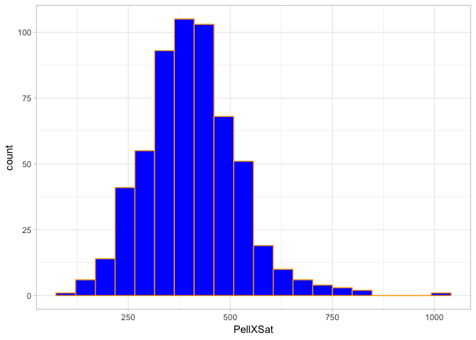
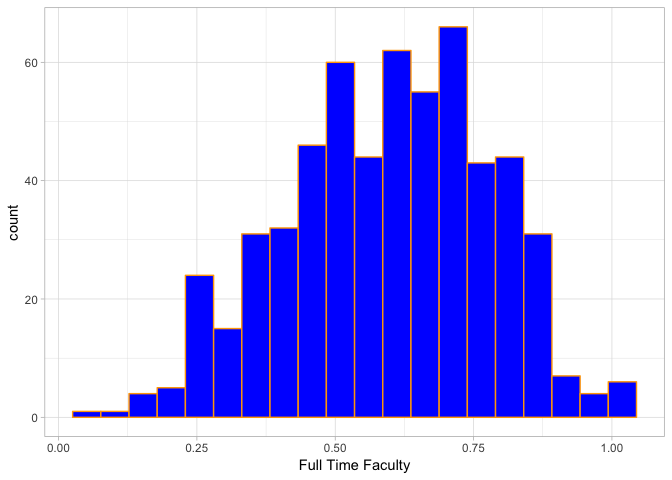
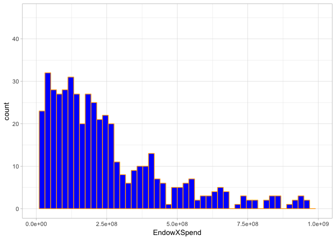
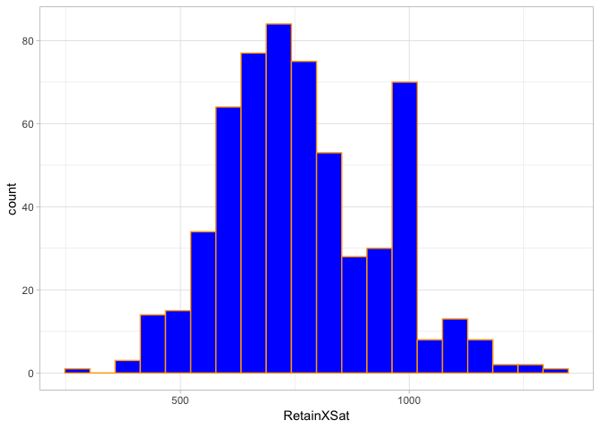
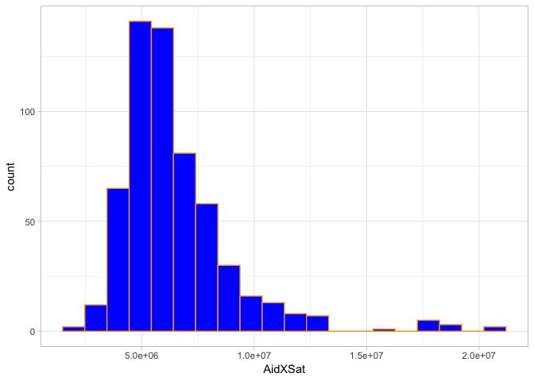

VisualizationExploration
================
Kevin Letourneau
May 22, 2019

``` r
dir <- "data"
file <- "institution_data.csv"
data <- read_csv(here::here(dir,file))
```

    ## Parsed with column specification:
    ## cols(
    ##   .default = col_double(),
    ##   institution_name = col_character(),
    ##   basic = col_character()
    ## )

    ## See spec(...) for full column specifications.

``` r
head(data)
```

    ## # A tibble: 6 x 20
    ##   institution_name basic grad_rate student_count spending_per_aw…
    ##   <chr>            <chr>     <dbl>         <dbl>            <dbl>
    ## 1 Alabama A&M Uni… Mast…     0.142          4051           105331
    ## 2 University of A… Rese…     0.209         11502           136546
    ## 3 University of A… Rese…     0.209          5696            64418
    ## 4 Alabama State U… Mast…     0.116          5356           132407
    ## 5 Auburn Universi… Mast…     0.154          4322            58541
    ## 6 Auburn Universi… Rese…     0.215         19799            71999
    ## # … with 15 more variables: full_time_pct <dbl>, full_time_count <dbl>,
    ## #   med_sat_value <dbl>, aid_value <dbl>, endow_value <dbl>,
    ## #   grad_on_time_pct <dbl>, pell_value <dbl>, fresh_retain_value <dbl>,
    ## #   full_time_fac_pct <dbl>, EndowXSpend <dbl>, PellXSat <dbl>,
    ## #   RetainXSat <dbl>, AidXSat <dbl>, AidXEndow <dbl>, id <dbl>

``` r
grad <- ggplot(data = data, aes(x=grad_rate)) +
               geom_histogram(binwidth = 0.025, bins = 20, fill = "blue", color = "orange")+
               labs(x="Graduation Rate")+
               theme_light()

#grad
```

``` r
endow <- ggplot(data = data, aes(x=endow_value)) +
                geom_histogram(bins = 50, fill = "blue", color = "orange")+
                labs(x="Endowment Value")+
                xlim(0,40000)+
                theme_light()
#endow
```

``` r
student <- ggplot(data = data, aes(x=student_count)) +
                  geom_histogram(bins = 20, fill = "blue", color = "orange")+
                  labs(x="Student Count")+
                  theme_light()
#student
```

``` r
spending <- ggplot(data = data, aes(x=spending_per_award)) +
                   geom_histogram(bins = 25, fill = "blue", color = "orange")+
                   labs(x="Spending Per Award")+
                   theme_light()
#spending
```

``` r
cowplot::plot_grid(grad,endow,student,spending,
                   labels = "AUTO",
                   label_size = 18,
                   align = "hv")
```

    ## Warning: Removed 11 rows containing non-finite values (stat_bin).

    ## Warning: Removed 2 rows containing missing values (geom_bar).

<!-- -->

A: Grad rate appears to be normally distributed with a mean around 0.2
and a median around 0.2.

B:

C:

D:

``` r
fullpct <- ggplot(data = data, aes(x=full_time_pct)) +
                  geom_histogram(bins = 20, fill = "blue", color = "orange")+
                  labs(x="Fulltime Student Percentage")+
                  theme_light()
fullpct
```

<!-- -->

``` r
fullcount <- ggplot(data = data, aes(x=full_time_count)) +
                    geom_histogram(bins = 20, fill = "blue", color = "orange")+
                    labs(x="Fulltime Student Count")+
                    theme_light()
fullcount
```

<!-- -->

``` r
medsat <- ggplot(data = data, aes(x=med_sat_value)) +
                 geom_histogram(bins = 20, fill = "blue", color = "orange")+
                 labs(x="Median SAT Score")+
                 theme_light()
medsat
```

<!-- -->

``` r
aid <- ggplot(data = data, aes(x=aid_value)) +
              geom_histogram(bins = 30, fill = "blue", color = "orange")+
              labs(x="Aid Value")+
              theme_light()
aid
```

<!-- -->

``` r
gradtime <- ggplot(data = data, aes(x=grad_on_time_pct)) +
                   geom_histogram(bins = 20, fill = "blue", color = "orange")+
                   labs(x="Graduating on Time")+
                   theme_light()
gradtime
```

<!-- -->

``` r
pell <- ggplot(data = data, aes(x=pell_value)) +
               geom_histogram(bins = 20, fill = "blue", color = "orange")+
               labs(x="Pell Value")+
               theme_light()
pell
```

<!-- -->

``` r
fresh <- ggplot(data = data, aes(x=fresh_retain_value)) +
                geom_histogram(binwidth = 0.025, fill = "blue", color = "orange")+
                labs(x="Freshman Retainment")+
                theme_light()
fresh
```

<!-- -->

``` r
fullfac <- ggplot(data = data, aes(x=full_time_fac_pct)) +
                  geom_histogram(bins = 20, fill = "blue", color = "orange")+
                  labs(x="Full Time Faculty")+
                  theme_light()
fullfac
```

    ## Warning: Removed 1 rows containing non-finite values (stat_bin).

<!-- -->

``` r
endowspend <- ggplot(data = data, aes(x=EndowXSpend)) +
                     geom_histogram(bins = 50, fill = "blue", color = "orange")+
                     xlim(0,1000000000)+
                     theme_light()
endowspend
```

    ## Warning: Removed 56 rows containing non-finite values (stat_bin).

    ## Warning: Removed 2 rows containing missing values (geom_bar).

<!-- -->

``` r
pellsat <- ggplot(data = data, aes(x=PellXSat)) +
                  geom_histogram(bins = 20, fill = "blue", color = "orange")+
                  theme_light()
pellsat
```

<!-- -->

``` r
retainsat <- ggplot(data = data, aes(x=RetainXSat)) +
                    geom_histogram(bins = 20, fill = "blue", color = "orange")+
                    theme_light()
retainsat 
```

<!-- -->

``` r
aidsat <- ggplot(data = data, aes(x=AidXSat)) +
                 geom_histogram(bins = 20, fill = "blue", color = "orange")+
                 theme_light()
aidsat
```

<!-- -->

``` r
aidendow <- ggplot(data = data, aes(x=AidXEndow)) +
                   geom_histogram(bins = 50, fill = "blue", color = "orange")+
                   xlim(0,100000000)+
                   theme_light()
aidendow
```

    ## Warning: Removed 52 rows containing non-finite values (stat_bin).

    ## Warning: Removed 2 rows containing missing values (geom_bar).

<!-- -->
